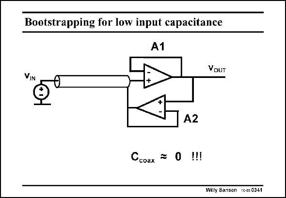

# SANSEN-0341 · Bootstrapping for low input capacitance

章节：03 差分电压放大器与电流放大器  
PDF 页：108；书本页：110；幻灯片编号：0341  
状态：unreviewed



## 对应教材讲解

### PDF 108 · 书本 110

Bootstrapping has actually been introduced to nullify the effect of the input capacitance of a coax cable in front of a preamplifier. Indeed the second buffer A2 will ensure that the outer screen of the coax cable is at the same potential as the inner conductor. As a result there is no voltage difference between inner and outer wire of that cable. Its capacitance (of up to 1pF/cm) is thus nullified. The capacitance of the cable is ‘‘bootstrapped out’’. The input capacitance is either quite small or the input impedance is exceedingly high!

## 公式／性能结论候选摘录

以下为规则截取的原文，尚未逐项判读。

- PDF 108: As a result there is no voltage difference between inner and outer wire of that cable.
- PDF 108: Its capacitance (of up to 1pF/cm) is thus nullified.

## 曲线结论候选摘录

以下为规则截取的原文，尚未逐项判读。

（未由规则找到；不代表原页没有此类内容。）

## 原文条件与近似候选摘录

以下为规则截取的原文，尚未逐项判读。

（未由规则找到；不代表原页没有此类内容。）

## 幻灯片 OCR（未校正）

```text
Bootstrapping for low input capacitance
A1
VOUT
VIN
A2
Ccoax = 0 !!!
Willy Sansen C-05 0341
```

数学上下标、分数及正负号以原图为准。电路图已保留；未核对的连接不输出成可仿真 netlist。
