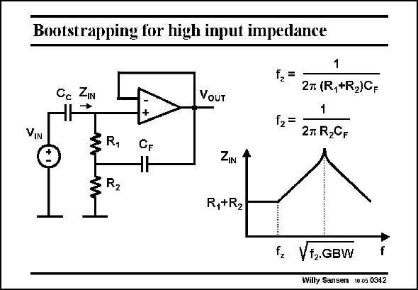

# SANSEN-0342 · Bootstrapping for high input impedance

章节：03 差分电压放大器与电流放大器  
PDF 页：108；书本页：110；幻灯片编号：0342  
状态：unreviewed



## 对应教材讲解

### PDF 108 · 书本 110

This buffer has a very high input impedance, despite the biasing resistors R and R . 1 2 It is often used to measure bio-impedances. For safety, a coupling capacitor has to be used. Biasing resistors are thus needed to define the DC conditions of the opamp. The+input is now at ground and so is the output. These resistors would also draw AC current, which is not allowed. For this purpose resistor R is boot- 1 strapped out by use of feedback capacitor C . F For sufficient high gain in the opamp, the output follows the input voltage. The voltage across resistor R is approximately zero. It is thus bootstrapped out. It presents a resistance of infinity. 1 This phenomenon starts where capacitance C starts to take effect, which is at the zero fre- F quency f . z In practice however the gain of the opamp is limited. Its gain decreases towards the GBW. As a consequence, the input impedance will not continue to rise. It settles around the frequency halfway between f and the GBW (on a logarithmic scale). 2 For example, if two resistors are taken of 1 MV and a capacitor C of 0.1 mF, the zero F frequency f is 0.8 Hz and the peak frequency occurs at 1.3 kHz for a GBW of 1 MHz. At this z point Z is about 1.6 GV. IN

## 公式／性能结论候选摘录

以下为规则截取的原文，尚未逐项判读。

- PDF 108: Biasing resistors are thus needed to define the DC conditions of the opamp.
- PDF 108: F For sufficient high gain in the opamp, the output follows the input voltage.
- PDF 108: It is thus bootstrapped out.
- PDF 108: It presents a resistance of infinity. 1 This phenomenon starts where capacitance C starts to take effect, which is at the zero fre- F quency f . z In practice however the gain of the opamp is limited.
- PDF 108: Its gain decreases towards the GBW.

## 曲线结论候选摘录

以下为规则截取的原文，尚未逐项判读。

- PDF 108: It settles around the frequency halfway between f and the GBW (on a logarithmic scale). 2 For example, if two resistors are taken of 1 MV and a capacitor C of 0.1 mF, the zero F frequency f is 0.8 Hz and the peak frequency occurs at 1.3 kHz for a GBW of 1 MHz.

## 原文条件与近似候选摘录

以下为规则截取的原文，尚未逐项判读。

- PDF 108: The voltage across resistor R is approximately zero.

## 幻灯片 OCR（未校正）

```text
Bootstrapping for high input impedance
Cc Z
VoUT
12=
f2=
VIN
1
2T (R,+R2)C.
1
2m R2CF
R1
R2
CF
ZIN
R,+R2
fz Vt2GBW
Willy Sansen 1005 0342
```

数学上下标、分数及正负号以原图为准。电路图已保留；未核对的连接不输出成可仿真 netlist。
