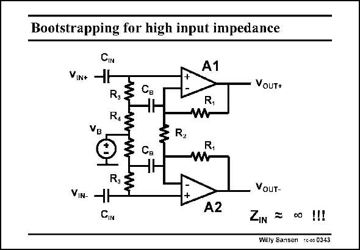

# SANSEN-0343 · Bootstrapping for high input impedance

章节：03 差分电压放大器与电流放大器  
PDF 页：109；书本页：111；幻灯片编号：0343  
状态：unreviewed



## 对应教材讲解

### PDF 109 · 书本 111

Bootstrapping has been introduced to increase the input impedance of biopotential preamplifiers. Both opamps A1 and A2 form an instrumentation amplifier with the three resistors R (twice) and R . 1 2 Its gain is set to a precise value of 2R /R by these 1 2 resistors. Moreover, the input impedances, at the + terminals of the opamps are very high. This is necessary not to draw any current from the electrodes (sensors). The input sensors are always decoupled from the opamp inputs by means of capacitors C . IN However, the + inputs of the opamps must be biased at a particular voltage. This is done by means of the resistors R /R . As a result the average output voltage is set by the biasing 3 4 voltage V . B The input impedance is reduced considerably by these resistors R /R . This why the bootstrap 3 4 capacitances C are added. They bootstrap the resistors R . Because of the feedback action of B 3 the opamp, the voltage across resistor R is nearly the same. It looks like a resistor with value 3 infinity. It is bootstrapped out. The input impedance is then exceedingly high!

## 公式／性能结论候选摘录

以下为规则截取的原文，尚未逐项判读。

- PDF 109: Bootstrapping has been introduced to increase the input impedance of biopotential preamplifiers.
- PDF 109: Both opamps A1 and A2 form an instrumentation amplifier with the three resistors R (twice) and R . 1 2 Its gain is set to a precise value of 2R /R by these 1 2 resistors.
- PDF 109: As a result the average output voltage is set by the biasing 3 4 voltage V .

## 曲线结论候选摘录

以下为规则截取的原文，尚未逐项判读。

（未由规则找到；不代表原页没有此类内容。）

## 原文条件与近似候选摘录

以下为规则截取的原文，尚未逐项判读。

（未由规则找到；不代表原页没有此类内容。）

## 幻灯片 OCR（未校正）

```text
Bootstrapping for high input impedance
CIN
VINA -H
R,:
VB
Cв
Ca
A1
R,
W
R,
R,
VoUT+
R,
VIN- -H
CIN
+
A2
VouT-
ZIN
=
00 1!!
Willy Sansen :G-05 0343
```

数学上下标、分数及正负号以原图为准。电路图已保留；未核对的连接不输出成可仿真 netlist。
