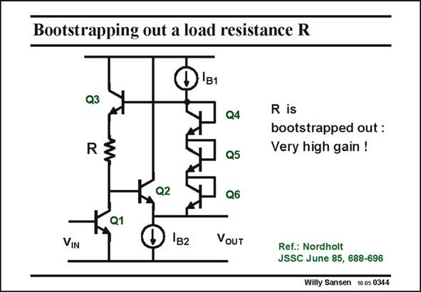

# SANSEN-0344 · Bootstrapping out a load resistance R

章节：03 差分电压放大器与电流放大器  
PDF 页：109；书本页：111；幻灯片编号：0344  
状态：unreviewed



## 对应教材讲解

### PDF 109 · 书本 111

In a similar way, a load resistor R of an amplifier can be bootstrapped out, in order to make its effective value much higher, also rendering the voltage gain much higher. An example is given in this slide. The amplifier simply consists of transistor Q1, followed by an emitter follower with transistor Q2. Its voltage gain would normally be g R. Depending on the m1 actual DC current, this gain is not all that high. Load resistor R is not connected to the supply voltage however, but to another emitter follower Q3, which is connected to the output voltage over three diode connected transistors, each carrying about 0.6 V. The DC voltage across resistor R is thus also about 0.6 V.

### PDF 110 · 书本 112

However, the AC voltage at the output of emitter follower Q3 is about the same as the actual output voltage v , which is the same as the AC voltage at the collector of the input transistor OUT Q1. There is now no AC voltage across resistor R. It is bootstrapped out. It appears to be infinitely high. As a result the voltage gain is quite high.

## 公式／性能结论候选摘录

以下为规则截取的原文，尚未逐项判读。

- PDF 109: In a similar way, a load resistor R of an amplifier can be bootstrapped out, in order to make its effective value much higher, also rendering the voltage gain much higher.
- PDF 109: Its voltage gain would normally be g R.
- PDF 109: Depending on the m1 actual DC current, this gain is not all that high.
- PDF 109: The DC voltage across resistor R is thus also about 0.6 V.
- PDF 110: As a result the voltage gain is quite high.

## 曲线结论候选摘录

以下为规则截取的原文，尚未逐项判读。

（未由规则找到；不代表原页没有此类内容。）

## 原文条件与近似候选摘录

以下为规则截取的原文，尚未逐项判读。

（未由规则找到；不代表原页没有此类内容。）

## 幻灯片 OCR（未校正）

```text
Bootstrapping out a load resistance R
B1
Q3
Q4
RZ
R is
bootstrapped out :
Very high gain !
Q5
Q2
Q6
VIN
1в2
VouT
Ref.: Nordholt
JSSC June 85, 688-696
Willy Sansen 10 0s 0344
```

数学上下标、分数及正负号以原图为准。电路图已保留；未核对的连接不输出成可仿真 netlist。
