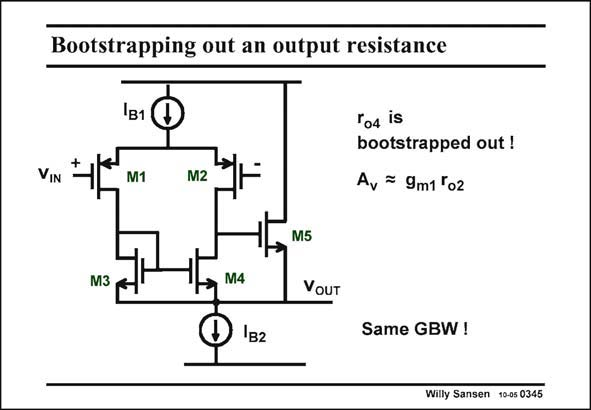

# SANSEN-0345 · Bootstrapping out an output resistance

章节：03 差分电压放大器与电流放大器  
PDF 页：110；书本页：112；幻灯片编号：0345  
状态：unreviewed



## 对应教材讲解

### PDF 110 · 书本 112

In a similar way, transistor M5 bootstraps out the output resistance of transistor M4 such that only r is o2 left in the gain expression. Transistor M5 actually functions as a source follower. Its gain approximates to unity, as for the buffer A2 in the previous slide. Transistor M5 sees thus the same AC voltage at Drain and Source. As a result, its output resistance r is booto4 strapped out. In order to really increase the gain, we would have to add cascodes in series with transistors M1 and M2, or design them with large channel lengths. Note that this gain enhancement technique does not affect the GBW, as we have seen before with all gain enhancement techniques. Bootstrapping is a fourth technique for gain enhancement. In practice we will use combinations of all these four techniques. We will need them as we go deeper and deeper into deep submicron CMOS!

## 公式／性能结论候选摘录

以下为规则截取的原文，尚未逐项判读。

- PDF 110: In a similar way, transistor M5 bootstraps out the output resistance of transistor M4 such that only r is o2 left in the gain expression.
- PDF 110: Its gain approximates to unity, as for the buffer A2 in the previous slide.
- PDF 110: Transistor M5 sees thus the same AC voltage at Drain and Source.
- PDF 110: As a result, its output resistance r is booto4 strapped out.
- PDF 110: In order to really increase the gain, we would have to add cascodes in series with transistors M1 and M2, or design them with large channel lengths.
- PDF 110: Note that this gain enhancement technique does not affect the GBW, as we have seen before with all gain enhancement techniques.
- PDF 110: Bootstrapping is a fourth technique for gain enhancement.

## 曲线结论候选摘录

以下为规则截取的原文，尚未逐项判读。

（未由规则找到；不代表原页没有此类内容。）

## 原文条件与近似候选摘录

以下为规则截取的原文，尚未逐项判读。

- PDF 110: Its gain approximates to unity, as for the buffer A2 in the previous slide.

## 幻灯片 OCR（未校正）

```text
Bootstrapping out an output resistance
VIN
1BI0
M1
M2
ro4 is
bootstrapped out !
A, = 9m1 '02
M5
M3
VoUT
Same GBW !
Willy Sansen 10-05 0345
```

数学上下标、分数及正负号以原图为准。电路图已保留；未核对的连接不输出成可仿真 netlist。
