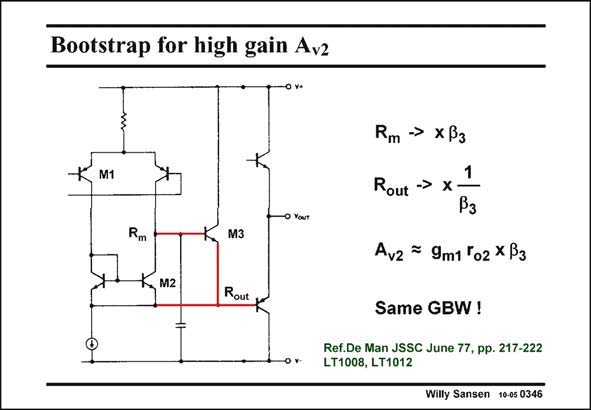

# SANSEN-0346 · Bootstrap for high gain Av2

章节：03 差分电压放大器与电流放大器  
PDF 页：110；书本页：112；幻灯片编号：0346  
状态：unreviewed



## 对应教材讲解

### PDF 110 · 书本 112

A practical example of this bootstrapping technique is shown in this slide. It uses bipolar transistors. This example was published a long time ago. Since the beta is an additional parameter in a bipolar transistor, it also appears in the gain expressions. Note that the output impedance, which was already low because we are dealing with an emitter follower, is reduced further. It is now quite low. This is an ideal situation in view of the need to develop the next stage.

## 公式／性能结论候选摘录

以下为规则截取的原文，尚未逐项判读。

- PDF 110: Since the beta is an additional parameter in a bipolar transistor, it also appears in the gain expressions.

## 曲线结论候选摘录

以下为规则截取的原文，尚未逐项判读。

（未由规则找到；不代表原页没有此类内容。）

## 原文条件与近似候选摘录

以下为规则截取的原文，尚未逐项判读。

（未由规则找到；不代表原页没有此类内容。）

## 幻灯片 OCR（未校正）

```text
Bootstrap for high gain Av2
-0 v+
M1
Rm → xB3
Rout
->
X
Rm
M3
1
Pз
Avz = 9m1 'o2 XB3
M2
Rout
Same GBW !
Ref.De Man JSSC June 77, pp. 217-222
LT1008, LT1012
Willy Sansen 1005 0346
```

数学上下标、分数及正负号以原图为准。电路图已保留；未核对的连接不输出成可仿真 netlist。
