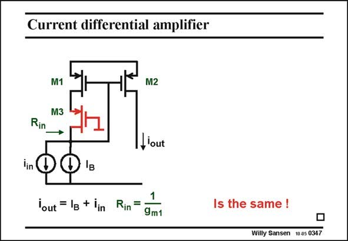

# SANSEN-0347 · Current differential amplifier

章节：03 差分电压放大器与电流放大器  
PDF 页：111；书本页：113；幻灯片编号：0347  
状态：unreviewed



## 对应教材讲解

### PDF 111 · 书本 113

After we have discussed the OTA, which is in effect a single-ended differential voltage amplifier, we focus on the most used singleended differential current amplifier. It is derived from a conventional current mirror, to which a cascode is added. This quite easy as the V of the input MOST M1 GS1 is fairly large, for example 0.7 V if V =0.5 V. This T gives us plenty of room for cascodes. One single cascode requires only 0.2 V! It is realized by means of transistor M3. This additional cascode does not change anything in the current mirror. The diode-connected transistor will be more accurate as more feedback loop gain is now available. The two input current sources, one for DC denoted by I and one for AC i , will be mirrored B in just as in the situation without cascode.

## 公式／性能结论候选摘录

以下为规则截取的原文，尚未逐项判读。

- PDF 111: The diode-connected transistor will be more accurate as more feedback loop gain is now available.

## 曲线结论候选摘录

以下为规则截取的原文，尚未逐项判读。

（未由规则找到；不代表原页没有此类内容。）

## 原文条件与近似候选摘录

以下为规则截取的原文，尚未逐项判读。

（未由规则找到；不代表原页没有此类内容。）

## 幻灯片 OCR（未校正）

```text
Current differential amplifier
M1
M3
Rin
→
M2
I,'out
.F
lout = lg + lin
Rin= 1
9m1
Is the same !
Willy Sansen 10 as 0347
```

数学上下标、分数及正负号以原图为准。电路图已保留；未核对的连接不输出成可仿真 netlist。
