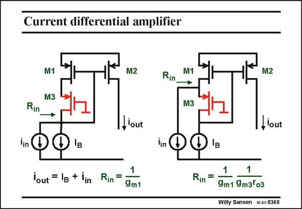

# SANSEN-0348 · Current differential amplifier

章节：03 差分电压放大器与电流放大器  
PDF 页：111；书本页：113；幻灯片编号：0348  
状态：unreviewed



## 对应教材讲解

### PDF 111 · 书本 113

The addition of this cascode creates an additional node however. This node is more attractive as an input than the original one. The reason is that the impedance at this point is g r times lower than at m3 o3 the original input. This is a result of the feedback loop. This factor is the additional loop gain as a result of the addition of the cascode. Therefore, the input signal current source is led to the Source of the cascode, rather than to its Drain. It is easier to realize an ideal current source when the input impedance is smaller. Moreover, the input capacitance at this point will be smaller. Note that the input signal current flows through M1, as there is no outlet through M3. This current is then mirrored by the current mirror M1-M2.

## 公式／性能结论候选摘录

以下为规则截取的原文，尚未逐项判读。

- PDF 111: This factor is the additional loop gain as a result of the addition of the cascode.
- PDF 111: Therefore, the input signal current source is led to the Source of the cascode, rather than to its Drain.

## 曲线结论候选摘录

以下为规则截取的原文，尚未逐项判读。

（未由规则找到；不代表原页没有此类内容。）

## 原文条件与近似候选摘录

以下为规则截取的原文，尚未逐项判读。

（未由规则找到；不代表原页没有此类内容。）

## 幻灯片 OCR（未校正）

```text
Current differential amplifier
M1
M3
M2
M1
M2
Rin
Rin
M3
1, lout
lout
lin
lin
Yout = Ig + lin
Rin =
9m1
Rin
=
9m1 9m3'оз
Willy Sansen 10 a5 0348
```

数学上下标、分数及正负号以原图为准。电路图已保留；未核对的连接不输出成可仿真 netlist。
