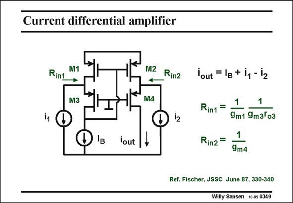

# SANSEN-0349 · Current differential amplifier

章节：03 差分电压放大器与电流放大器  
PDF 页：112；书本页：114；幻灯片编号：0349  
状态：unreviewed



## 对应教材讲解

### PDF 112 · 书本 114

Addition of another cascode by means of M4, leads to the current differential amplifier in this slide. This allows for the application of another input current i , which flows to the 2 output through M4.The output current contains the differential input current, superimposed on the DC biasing current I . B The input impedances for the input currents, are not the same. For current i , the 1 input impedance is quite small whereas for input current i , it will depend on the load impedance. For a small load 2 impedance, the input resistance will be 1/g . m4 This is probably the most used current differential amplifier. It will be used in many operational amplifiers to convert the differential output signal to a single-ended one.

## 公式／性能结论候选摘录

以下为规则截取的原文，尚未逐项判读。

- PDF 112: For current i , the 1 input impedance is quite small whereas for input current i , it will depend on the load impedance.

## 曲线结论候选摘录

以下为规则截取的原文，尚未逐项判读。

（未由规则找到；不代表原页没有此类内容。）

## 原文条件与近似候选摘录

以下为规则截取的原文，尚未逐项判读。

（未由规则找到；不代表原页没有此类内容。）

## 幻灯片 OCR（未校正）

```text
Current differential amplifier
Rint
M1
M3
M2 Rinz
M4
'в
lout
lout = 1g + 11 - 12
Rin1 =
1
9m1 9m3Го3
Rin2=
9m4
Ref. Fischer, JSSC June 87, 330-340
Willy Sansen 10 a5 0349
```

数学上下标、分数及正负号以原图为准。电路图已保留；未核对的连接不输出成可仿真 netlist。
