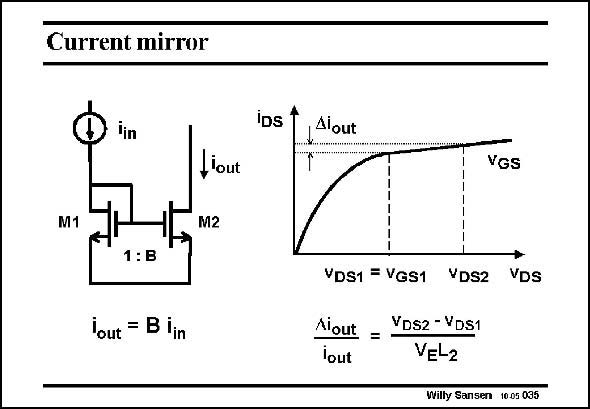

# SANSEN-035 · Current mirror

章节：03 差分电压放大器与电流放大器  
PDF 页：89；书本页：91；幻灯片编号：035  
状态：unreviewed



## 对应教材讲解

### PDF 88 · 书本 90

Addition of a single-transistor amplifier to the diode connected MOST, yields a current mirror. The amplifier compensates the nonlinearity of the diode to provide a perfectly linear current ratio B. This circuit will be utilized for both biasing and for wideband current amplification.

### PDF 89 · 书本 91

In practice, the current ratio is not that accurate. Indeed, both transistor may not operate at the same v DS voltage. A difference in v DS will give a difference in current, as the i −v charac- DS DS teristic is not that flat. This difference is easily calculated. It is related to the Early voltage and hence to the channel length L . 2 The larger the channel length, the flatter the curve and the smaller the current difference will be. It is difficult to make that v voltage difference zero. This is why we resort to circuit techniques. DS

## 公式／性能结论候选摘录

以下为规则截取的原文，尚未逐项判读。

（未由规则找到；不代表原页没有此类内容。）

## 曲线结论候选摘录

以下为规则截取的原文，尚未逐项判读。

- PDF 89: It is related to the Early voltage and hence to the channel length L . 2 The larger the channel length, the flatter the curve and the smaller the current difference will be.

## 原文条件与近似候选摘录

以下为规则截取的原文，尚未逐项判读。

（未由规则找到；不代表原页没有此类内容。）

## 幻灯片 OCR（未校正）

```text
Current mirror
Tin
M1
,'out
M2
1:B
lout = B iin
IDs
Alout
VGS
VDS1 = VGS1 VDS2
VDs
Aiout = YDS2 -VDs1
lout
VEL2
Willy Sansen 10.05 035
```

数学上下标、分数及正负号以原图为准。电路图已保留；未核对的连接不输出成可仿真 netlist。
