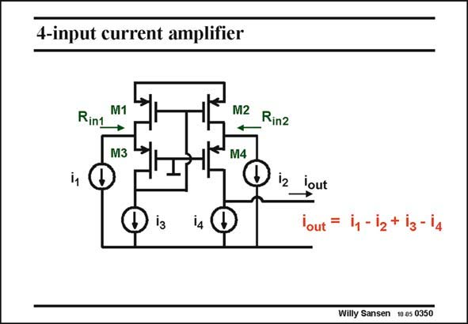

# SANSEN-0350 · 4-input current amplifier

章节：03 差分电压放大器与电流放大器  
PDF 页：112；书本页：114；幻灯片编号：0350  
状态：unreviewed



## 对应教材讲解

### PDF 112 · 书本 114

This same current differential amplifier can easily be expanded to a four input current amplifier. It is sufficient to add an AC signal to the current sources i and i . In this way 3 4 a current difference-difference amplifier can be built or any other multiple-input analog processing block up to high frequencies. Note that only the output impedance is high. All other nodes are at 1/g level or m below.

## 公式／性能结论候选摘录

以下为规则截取的原文，尚未逐项判读。

（未由规则找到；不代表原页没有此类内容。）

## 曲线结论候选摘录

以下为规则截取的原文，尚未逐项判读。

（未由规则找到；不代表原页没有此类内容。）

## 原文条件与近似候选摘录

以下为规则截取的原文，尚未逐项判读。

（未由规则找到；不代表原页没有此类内容。）

## 幻灯片 OCR（未校正）

```text
4-input current amplifier
Rint
M1
M2 Rinz
M3
M4
i2
lout
I3
14
Willy Sansen 10 as 0350
```

数学上下标、分数及正负号以原图为准。电路图已保留；未核对的连接不输出成可仿真 netlist。
