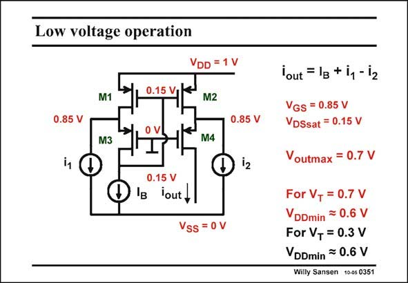

# SANSEN-0351 · Low voltage operation

章节：03 差分电压放大器与电流放大器  
PDF 页：113；书本页：115；幻灯片编号：0351  
状态：unreviewed



## 对应教材讲解

### PDF 112 · 书本 114

An important additional advantage of this current differential amplifier is that it can operate at very low supply voltages. This is shown in this slide for a 1 V supply voltage. For a V of 0.7 V, the V −V has to be deceased to 0.15 V rather than 0.2 V, to be able to T GS T cope with a supply voltage of 1 V. Indeed all V values are then 0.85 V. This gives plenty of GS headroom for the input current sources.

### PDF 113 · 书本 115

Note that the Gates of the cascodes M3 and M4 are now at ground, which is the lowest voltage available. The maximum output voltage V is 0.7 V as outmax we need at least 0.15 V V DS per transistor. It is clear that for deep submicron CMOS, where the V decreases to as little T as 0.3 V, the supply voltage can be as low as 0.6 V. Quite a low value indeed!!

## 公式／性能结论候选摘录

以下为规则截取的原文，尚未逐项判读。

- PDF 113: It is clear that for deep submicron CMOS, where the V decreases to as little T as 0.3 V, the supply voltage can be as low as 0.6 V.

## 曲线结论候选摘录

以下为规则截取的原文，尚未逐项判读。

（未由规则找到；不代表原页没有此类内容。）

## 原文条件与近似候选摘录

以下为规则截取的原文，尚未逐项判读。

（未由规则找到；不代表原页没有此类内容。）

## 幻灯片 OCR（未校正）

```text
Low voltage operation
0.15 V
M1
VDD = 1 V
M2
0.85 V
0.85 V
M3
M4
i1
0.15 V
Ig lout,
Vss = 0 V
lout = 1g + iy - i2
VGS = 0.85 V
VDSsat = 0.15 V
Voutmax = 0.7 V
For V, = 0.7 V
VDDmin = 0.6 V
For V, = 0.3 V
VDDmin = 0.6 V
Willy Sansen 10-05 0351
```

数学上下标、分数及正负号以原图为准。电路图已保留；未核对的连接不输出成可仿真 netlist。
