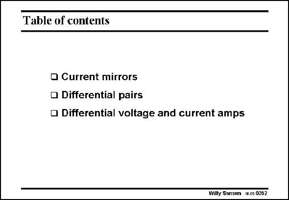

# SANSEN-0352 · Table of contents

章节：03 差分电压放大器与电流放大器  
PDF 页：113；书本页：115；幻灯片编号：0352  
状态：unreviewed



## 对应教材讲解

### PDF 113 · 书本 115

This concludes the Chapter on two-transistor circuits such as current mirrors and differential pairs. They have been used to build up the most common voltage and current differential amplifiers with single-ended output. We will use them routinely in the operational amplifiers.

## 公式／性能结论候选摘录

以下为规则截取的原文，尚未逐项判读。

（未由规则找到；不代表原页没有此类内容。）

## 曲线结论候选摘录

以下为规则截取的原文，尚未逐项判读。

（未由规则找到；不代表原页没有此类内容。）

## 原文条件与近似候选摘录

以下为规则截取的原文，尚未逐项判读。

（未由规则找到；不代表原页没有此类内容。）

## 幻灯片 OCR（未校正）

```text
Table of contents
• Current mirrors
• Differential pairs
• Differential voltage and current amps
Willy Sansen 1005 0352
```

数学上下标、分数及正负号以原图为准。电路图已保留；未核对的连接不输出成可仿真 netlist。
