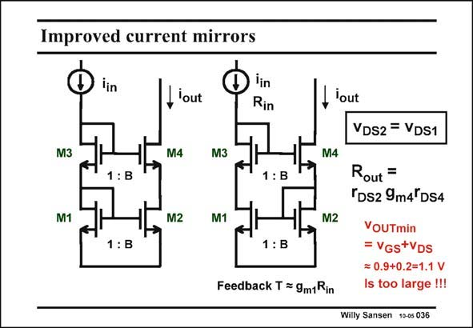

# SANSEN-036 · Improved current mirrors

章节：03 差分电压放大器与电流放大器  
PDF 页：89；书本页：91；幻灯片编号：036  
状态：unreviewed



## 对应教材讲解

### PDF 89 · 书本 91

Now let us focus on how to make the current difference zero. For this purpose we have to add two transistors M3 and M4, which have as main goal to make the voltages v across the current DS mirror devices M1 and M2 as equal as possible. We have two realizations. The left one consists of a voltage divider by means of two diode connected transistors M1 and M3, connected to a cascoded amplifier M2 and M4. Transistors M4 and M2 have the same W/L ratio as M2 and M1, which is B. Since M1 and M2 have the same V , transistors M3 and M4 must have the same V as well. The currents GS GS through M3 and M4 have the same ratio B as their W/L ratios. As a result the voltages v DS1 and v must also be the same. The current ratio will therefore be quite accurate. DS2 A similar reasoning is valid for the current mirror on the right. There is one major difference however. The circuit on the right is a feedback amplifier with loop gain T. Since all time constants in that loop are of the same order of magnitude, they create a system with several poles. As a result, peaking can occur in the current transfer characteristic. An important disadvantage of both current mirrors, is that their minimum output voltage (compliance voltage) is quite high! As a result they cannot be used in low-voltage applications!

## 公式／性能结论候选摘录

以下为规则截取的原文，尚未逐项判读。

- PDF 89: For this purpose we have to add two transistors M3 and M4, which have as main goal to make the voltages v across the current DS mirror devices M1 and M2 as equal as possible.
- PDF 89: As a result the voltages v DS1 and v must also be the same.
- PDF 89: The current ratio will therefore be quite accurate.
- PDF 89: The circuit on the right is a feedback amplifier with loop gain T.
- PDF 89: As a result, peaking can occur in the current transfer characteristic.
- PDF 89: As a result they cannot be used in low-voltage applications!

## 曲线结论候选摘录

以下为规则截取的原文，尚未逐项判读。

- PDF 89: As a result, peaking can occur in the current transfer characteristic.

## 原文条件与近似候选摘录

以下为规则截取的原文，尚未逐项判读。

（未由规则找到；不代表原页没有此类内容。）

## 幻灯片 OCR（未校正）

```text
Improved current mirrors
iin
,lout
lin
Rin
M3
M4
M3
1: B
1: B
M1
M2
M1
1: B
1:B
Feedback T = 9m1Rin
lout
M4
M2
VDS2 = VDS1
Rout =
TDs2 9m4TDS4
VOUTmin
= VGs+VDS
= 0.9+0.2=1.1 V
Is too large !!!
Willy Sansen 10-05 036
```

数学上下标、分数及正负号以原图为准。电路图已保留；未核对的连接不输出成可仿真 netlist。
