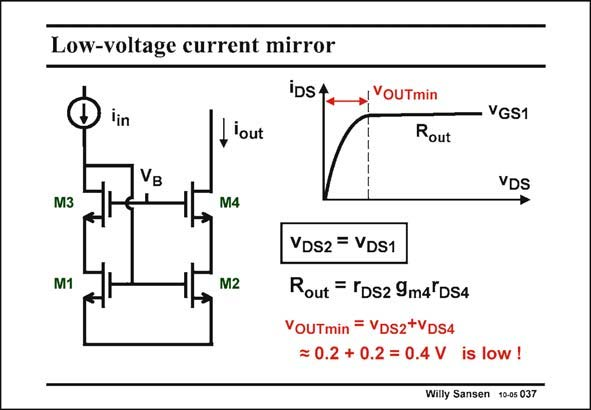

# SANSEN-037 · Low-voltage current mirror

章节：03 差分电压放大器与电流放大器  
PDF 页：90；书本页：92；幻灯片编号：037  
状态：unreviewed



## 对应教材讲解

### PDF 90 · 书本 92

For low supply voltages, this current mirror is an ideal choice! This is actually a conventional two-transistor current mirror, in which two cascodes M3 and M4 have been added. We find the same advantages as in both previous current mirrors: 1. Both voltages v and DS1 v are equal resulting in DS2 an accurate current ratio 2. The output resistance is very high as for any cascode configuration We now have a considerable advantage in that we can set the biasing voltage such that only 0.2 Volt is left across M2 and M4, keeping both of them in saturation! For a V of 0.7 V, the V T GS is about 0.9 V. Hence V must be about 1.1 V. B The compliance voltage V is thus now reduced from 1.1 V to 0.4 V, which is a significant OUTmin difference. This is also a disadvantage, we now need an external biasing voltage V . B

## 公式／性能结论候选摘录

以下为规则截取的原文，尚未逐项判读。

- PDF 90: Both voltages v and DS1 v are equal resulting in DS2 an accurate current ratio 2.
- PDF 90: B The compliance voltage V is thus now reduced from 1.1 V to 0.4 V, which is a significant OUTmin difference.

## 曲线结论候选摘录

以下为规则截取的原文，尚未逐项判读。

（未由规则找到；不代表原页没有此类内容。）

## 原文条件与近似候选摘录

以下为规则截取的原文，尚未逐项判读。

- PDF 90: The output resistance is very high as for any cascode configuration We now have a considerable advantage in that we can set the biasing voltage such that only 0.2 Volt is left across M2 and M4, keeping both of them in saturation!

## 幻灯片 OCR（未校正）

```text
Low-voltage current mirror
iDsA
lin
, lout
VOUTmin
Rout
VGS1
VB
VDS
M3
M4
M1
M2
VDS2 = VDS1
Rout = TDs2 9m4°DS4
VOUTmin = VDs2+VDS4
= 0.2 + 0.2 = 0.4 V is low !
Willy Sansen 10-05 037
```

数学上下标、分数及正负号以原图为准。电路图已保留；未核对的连接不输出成可仿真 netlist。
