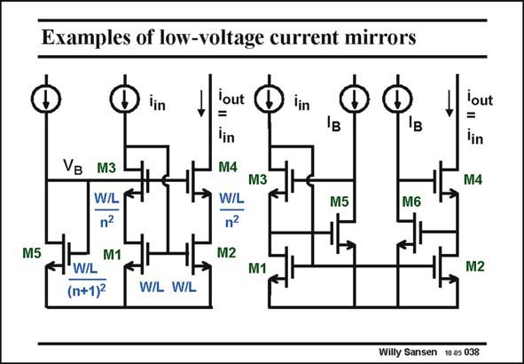

# SANSEN-038 · Examples of low-voltage current mirrors

章节：03 差分电压放大器与电流放大器  
PDF 页：90；书本页：92；幻灯片编号：038  
状态：unreviewed



## 对应教材讲解

### PDF 90 · 书本 92

Two examples are given of the low-voltage current mirror described previously. Both of them use cascodes. Both of them provide feedback from the Drain of transistor M3 to the Gates of current-mirror devices M1 and M2. Both of them provide a large output impedance and allow a large output voltage swing. On the left, an example is given of how to provide the biasing voltage V of the B cascode devices. It is clear that transistor M5 must have a much smaller W/L so that its V is about 0.2 V larger than GS that of cascode transistors M3 and M4. We need about 0.2 V as a V for both current mirror DS devices M1 and M2. A good value for the parameter is approximately 5. The current mirror on the right is simply the low-voltage current mirror given previously, in which gain-boosting is applied to the cascode transistors. It allows the same output swing as the circuit on the left but the output impedance is even higher.

## 公式／性能结论候选摘录

以下为规则截取的原文，尚未逐项判读。

- PDF 90: The current mirror on the right is simply the low-voltage current mirror given previously, in which gain-boosting is applied to the cascode transistors.

## 曲线结论候选摘录

以下为规则截取的原文，尚未逐项判读。

（未由规则找到；不代表原页没有此类内容。）

## 原文条件与近似候选摘录

以下为规则截取的原文，尚未逐项判读。

- PDF 90: It is clear that transistor M5 must have a much smaller W/L so that its V is about 0.2 V larger than GS that of cascode transistors M3 and M4.
- PDF 90: A good value for the parameter is approximately 5.

## 幻灯片 OCR（未校正）

```text
Examples of low-voltage current mirrors
lin
M5
VB
M3
W/L
n?
W/L
M1
(n+1)2
lout
=
lin
M4
WIL
n?
M2
lin
Iв
M3
lout
lin
M4
M5
M6
M1
M2
W/L W/L
Willy Sansen 10 a5 038
```

数学上下标、分数及正负号以原图为准。电路图已保留；未核对的连接不输出成可仿真 netlist。
