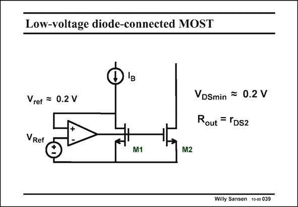

# SANSEN-039 · Low-voltage diode-connected MOST

章节：03 差分电压放大器与电流放大器  
PDF 页：91；书本页：93；幻灯片编号：039  
状态：unreviewed



## 对应教材讲解

### PDF 91 · 书本 93

If the compliance voltage of 0.4 V is still too high, one single output transistor can be used. An opamp is then used to provide feedback around the input device M1. Its drain voltage is then only 0.2 V, which is a lot less than the 0.9 V in a conventional current mirror (for a V of T 0.7 V). The output impedance is not very high. It is simply the output resistance of the output transistor M2. There are better uses for an opamp as shown next.

## 公式／性能结论候选摘录

以下为规则截取的原文，尚未逐项判读。

（未由规则找到；不代表原页没有此类内容。）

## 曲线结论候选摘录

以下为规则截取的原文，尚未逐项判读。

（未由规则找到；不代表原页没有此类内容。）

## 原文条件与近似候选摘录

以下为规则截取的原文，尚未逐项判读。

（未由规则找到；不代表原页没有此类内容。）

## 幻灯片 OCR（未校正）

```text
Low-voltage diode-connected MOST
Vref = 0.2 V
VDSmin = 0.2 V
Rout = rDS2
VRef
M1
M2
Willy Sansen 10-05 039
```

数学上下标、分数及正负号以原图为准。电路图已保留；未核对的连接不输出成可仿真 netlist。
