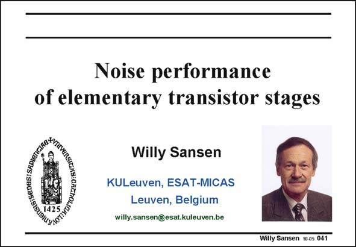

# SANSEN-041 · Slide 041

章节：04 基本晶体管级的噪声性能  
PDF 页：114；书本页：117；幻灯片编号：041  
状态：unreviewed



## 对应教材讲解

### PDF 114 · 书本 117

Before we go into more detail in opamp design, we want to know more about the limits of operation. At the low end this is noise, whereas at the high end it is distortion. This latter topic is discussed in Chapter 15. We now want to learn more about noise.

## 公式／性能结论候选摘录

以下为规则截取的原文，尚未逐项判读。

- PDF 114: Before we go into more detail in opamp design, we want to know more about the limits of operation.

## 曲线结论候选摘录

以下为规则截取的原文，尚未逐项判读。

（未由规则找到；不代表原页没有此类内容。）

## 原文条件与近似候选摘录

以下为规则截取的原文，尚未逐项判读。

（未由规则找到；不代表原页没有此类内容。）

## 幻灯片 OCR（未校正）

```text
Noise performance
of elementary transistor stages
Willy Sansen
KULeuven, ESAT-MICAS
Leuven, Belgium
willy.sansen@esat.kuleuven.be
Willy Sansen 10 05 041
```

数学上下标、分数及正负号以原图为准。电路图已保留；未核对的连接不输出成可仿真 netlist。
