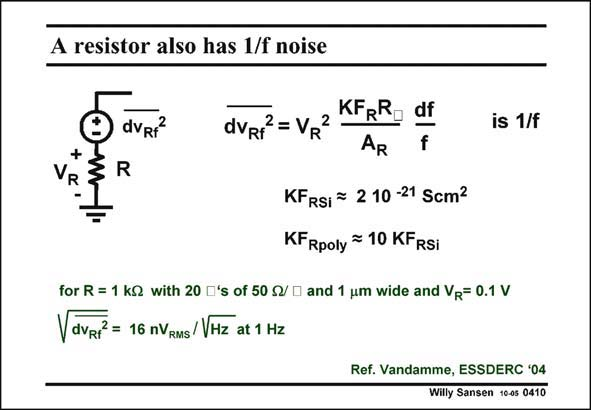

# SANSEN-0410 · A resistor also has 1/f noise

章节：04 基本晶体管级的噪声性能  
PDF 页：119；书本页：122；幻灯片编号：0410  
状态：unreviewed



## 对应教材讲解

### PDF 118 · 书本 121

A resistor also exhibits 1/f noise. In general, 1/f noise is dependent on size and the quality of conduction (or homogeneity). This is why the expression for the 1/f noise is a result of fitting lots of data. It contains the DC voltage across the resistor, the size (A or WL) and a factor KF , that indicates what R R material is to be used. For example a n-well resistor is single-crystalline silicon. This material is very homogeneous. As a result the KF factor is small. R

### PDF 119 · 书本 122

The same applies to all diffused resistances. Polysilicon resistors on the other hand are much worse. Discrete carbon resistors are probably the worst for 1/f noise. If we use the same resistor with much larger dimensions (same W/L but larger WL), then the 1/f noise is significantly reduced. Finally reducing the DC voltage to zero by putting a capacitance in series, also kills the 1/f noise. This is probably the most widely used technique in low-noise preamplifiers! Note that the 1/f noise is normally specified at 1 Hz. Since the noise voltage is inversely proportional to the square root of the frequency, it decreases only slowly.

## 公式／性能结论候选摘录

以下为规则截取的原文，尚未逐项判读。

- PDF 118: In general, 1/f noise is dependent on size and the quality of conduction (or homogeneity).
- PDF 118: As a result the KF factor is small.
- PDF 119: Since the noise voltage is inversely proportional to the square root of the frequency, it decreases only slowly.

## 曲线结论候选摘录

以下为规则截取的原文，尚未逐项判读。

（未由规则找到；不代表原页没有此类内容。）

## 原文条件与近似候选摘录

以下为规则截取的原文，尚未逐项判读。

- PDF 119: If we use the same resistor with much larger dimensions (same W/L but larger WL), then the 1/f noise is significantly reduced.

## 幻灯片 OCR（未校正）

```text
A resistor also has 1/f noise
+
VR
dvRt
R
dVRr=VR
KFRR- df
AR
f
KFRSi = 2 10-21 Scm?
KFRpoly = 10 KFRSi
for R = 1 kS with 20 ['s of 50 Q/ [ and 1 um wide and VR= 0.1 V
VdvRi = 16 nV/RMS /VHz at 1 Hz
is 1/f
Ref. Vandamme, ESSDERC '04
Willy Sansen 1005 0410
```

数学上下标、分数及正负号以原图为准。电路图已保留；未核对的连接不输出成可仿真 netlist。
