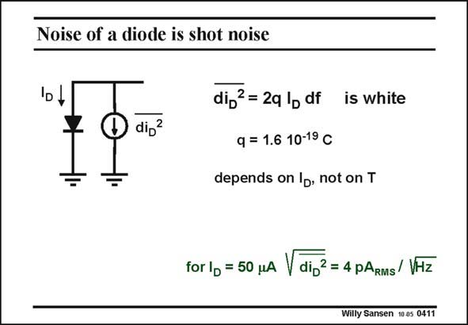

# SANSEN-0411 · Noise of a diode is shot noise

章节：04 基本晶体管级的噪声性能  
PDF 页：119；书本页：122；幻灯片编号：0411  
状态：unreviewed



## 对应教材讲解

### PDF 119 · 书本 122

The other source of white noise is the shot noise, generated by a junction, or diode. This is white noise but not thermal noise. Indeed this noise current is proportional to the current but is independent of the temperature. Cooling therefore, does not help! This applies to any junction (or diode) which carries current. It is irrelevant whether the current flows in the forward direction (as in any forward biased diode) or in the reverse direction (as in a photodiode). The same expression is still valid.

## 公式／性能结论候选摘录

以下为规则截取的原文，尚未逐项判读。

- PDF 119: Indeed this noise current is proportional to the current but is independent of the temperature.
- PDF 119: Cooling therefore, does not help!

## 曲线结论候选摘录

以下为规则截取的原文，尚未逐项判读。

（未由规则找到；不代表原页没有此类内容。）

## 原文条件与近似候选摘录

以下为规则截取的原文，尚未逐项判读。

（未由规则找到；不代表原页没有此类内容。）

## 幻灯片 OCR（未校正）

```text
Noise of a diode is shot noise
dig?
dij2 = 2q lp df
is white
q = 1.6 10-19 C
depends on lb, not on T
for lp = 50 uA dij2 = 4 pARMs/ VHz
Willy Sansen 10 05 0411
```

数学上下标、分数及正负号以原图为准。电路图已保留；未核对的连接不输出成可仿真 netlist。
