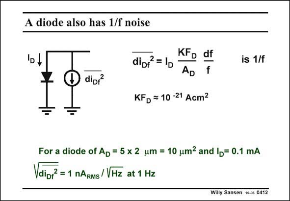

# SANSEN-0412 · A diode also has 1/f noise

章节：04 基本晶体管级的噪声性能  
PDF 页：120；书本页：123；幻灯片编号：0412  
状态：unreviewed



## 对应教材讲解

### PDF 119 · 书本 122

Obviously, a diode also exhibits 1/f noise. Again the amount of noise depends on the current through it, the size and the material used.

### PDF 120 · 书本 123

For example, a small thinfilm diode gives a significant amount of 1/f noise. A large (power) diode in single-crystalline silicon is not too bad. This corresponds to the value given in this slide. Obviously, the spreading on this value is quite large! A measurement on one single device is not relevant. Averages have to be taken over hundreds of devices!

## 公式／性能结论候选摘录

以下为规则截取的原文，尚未逐项判读。

- PDF 119: Again the amount of noise depends on the current through it, the size and the material used.

## 曲线结论候选摘录

以下为规则截取的原文，尚未逐项判读。

（未由规则找到；不代表原页没有此类内容。）

## 原文条件与近似候选摘录

以下为规则截取的原文，尚未逐项判读。

（未由规则找到；不代表原页没有此类内容。）

## 幻灯片 OCR（未校正）

```text
A diode also has 1/f noise
dipf
KFD df
dipf = 1p
AD
f
KFD = 10-21 Acm?
is 1/f
For a diode of Ap = 5 x 2 um = 10 um? and lp= 0.1 mA
Vdipf = 1 nARMs/VHz at 1 Hz
Willy Sansen 10os 0412
```

数学上下标、分数及正负号以原图为准。电路图已保留；未核对的连接不输出成可仿真 netlist。
