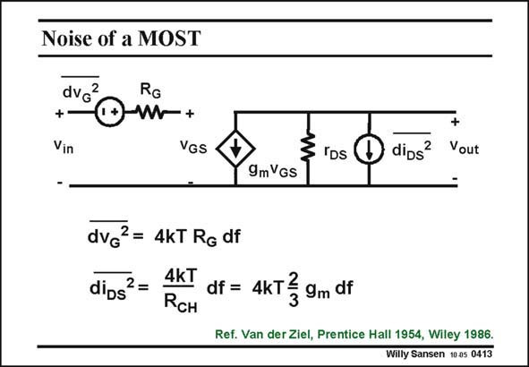

# SANSEN-0413 · Noise of a MOST

章节：04 基本晶体管级的噪声性能  
PDF 页：120；书本页：123；幻灯片编号：0413  
状态：unreviewed



## 对应教材讲解

### PDF 120 · 书本 123

A MOST has a resistive channel. As a result, it exhibits thermal noise, just like any other resistor. The channel is not very homogeneous, as it conducts well at the Source side, but is pinched off at the Drain side. This is why some integrals will be required to calculate the channel resistance and the noise generated by it. Nevertheless, the channel noise can be represented by a noise current source in parallel with the g current source. The integral leads to a effective channel resistor R of m CH 3/2g . The 4kT factor clearly shows that we are dealing with thermal noise. m In deep submicron or nanometer CMOS devices, velocity saturation appears. As a result the coefficient 2/3 increases (Ref. Han, JSSC, March ’05, 726–735). It is about 50% larger for 0.18 mm CMOS and doubles for 0.13 mm CMOS. The poly Gate resistor R cannot be discounted, however. Even if the Gate material is highly G doped, it can make a large contribution, depending on the actual dimensions, and on how long the Gate line is prolonged outside the active region.

## 公式／性能结论候选摘录

以下为规则截取的原文，尚未逐项判读。

- PDF 120: As a result, it exhibits thermal noise, just like any other resistor.
- PDF 120: As a result the coefficient 2/3 increases (Ref.
- PDF 120: Even if the Gate material is highly G doped, it can make a large contribution, depending on the actual dimensions, and on how long the Gate line is prolonged outside the active region.

## 曲线结论候选摘录

以下为规则截取的原文，尚未逐项判读。

（未由规则找到；不代表原页没有此类内容。）

## 原文条件与近似候选摘录

以下为规则截取的原文，尚未逐项判读。

- PDF 120: The 4kT factor clearly shows that we are dealing with thermal noise. m In deep submicron or nanometer CMOS devices, velocity saturation appears.

## 幻灯片 OCR（未校正）

```text
Noise of a MOST
dvc?
+-
Vin
RG
VGs
IDs
dips
+
Vout
9mVgs
dvg? = 4kT Rg df
dios" = AKT df = 4KT } gm df
Ref. Van der Ziel, Prentice Hall 1954, Wiley 1986.
Willy Sansen 1005 0413
```

数学上下标、分数及正负号以原图为准。电路图已保留；未核对的连接不输出成可仿真 netlist。
