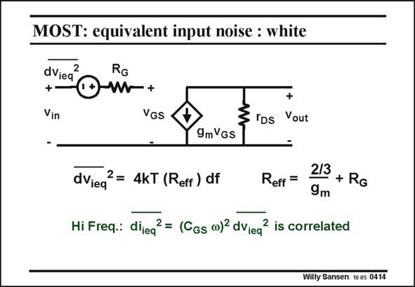

# SANSEN-0414 · MOST: equivalent input noise : white

章节：04 基本晶体管级的噪声性能  
PDF 页：121；书本页：124；幻灯片编号：0414  
状态：unreviewed



## 对应教材讲解

### PDF 120 · 书本 123

Normally we refer both white noise sources to the input, in order to be able to calculate the SNR at the input.

### PDF 121 · 书本 124

The channel noise current can easily be shifted to the input by dividing it by g m (and the power by g 2). m The two noise powers are then added at the input. In this way we obtain a thermal noise resistance R , eff which is the sum of both sources. The channel noise gives the first contribution. The Gate resistor R is the G other one. The input noise voltage is called the equivalent input noise voltage. It is inversely proportional to transconductance g , at m least whilst the Gate resistor is small. At very high frequencies, a capacitance C appears across the Gate-Source terminals. As a GS result, for a low source resistance (typically 50 V) a noise current can flow through capacitance C as shown in this slide. GS This current is obviously correlated to the equivalent input voltage. Their powers cannot be added up. However, this noise current is only relevant at very high frequencies, beyond f /5. It T is only relevant in the noise optimization of LNA’s, VCO’s and RF mixers.

## 公式／性能结论候选摘录

以下为规则截取的原文，尚未逐项判读。

- PDF 121: It is inversely proportional to transconductance g , at m least whilst the Gate resistor is small.

## 曲线结论候选摘录

以下为规则截取的原文，尚未逐项判读。

（未由规则找到；不代表原页没有此类内容。）

## 原文条件与近似候选摘录

以下为规则截取的原文，尚未逐项判读。

（未由规则找到；不代表原页没有此类内容。）

## 幻灯片 OCR（未校正）

```text
MOST: equivalent input noise : white
dViea
2
+
Vin
RG
+
VGS
+
"DS
Vout
9mVGS
dVieq
2= 4kT (Reff ) df
Reff =
2/3
+ RG
9m
Hi Freq.: dijea? = (CGs @)? dViea? is correlated
Hi Freq.: diieq
Willy Sansen 10 a5 0414
```

数学上下标、分数及正负号以原图为准。电路图已保留；未核对的连接不输出成可仿真 netlist。
