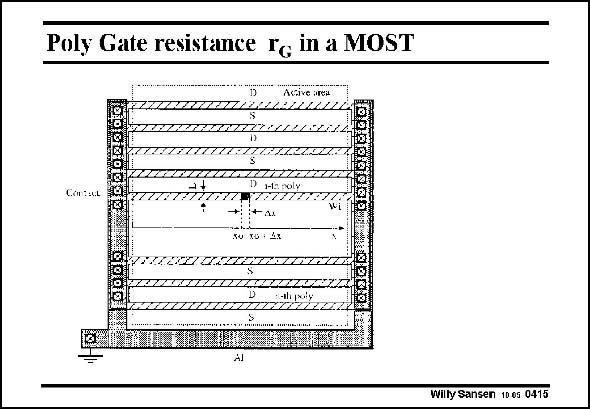

# SANSEN-0415 · Poly Gate resistance re in a MOST

章节：04 基本晶体管级的噪声性能  
PDF 页：121；书本页：124；幻灯片编号：0415  
状态：unreviewed



## 对应教材讲解

### PDF 121 · 书本 124

The equivalent input noise voltage of a MOST can be made small by increasing the transconductance. This will require a small V −V GS T but a large W/L and current. This is only true if the Gate resistance is small. In this layout a MOST is shown with very large W/L. The poly Gate lines between the Sources and Drains have become very long, generating a fairly large resistance. In order to avoid this resistance, it is better to divide the layout in several smaller blocks, such that the Gate contacts can be much closer to the middle of the Gate lines. The Gate resistance therefore depends very much on the layout style.

## 公式／性能结论候选摘录

以下为规则截取的原文，尚未逐项判读。

- PDF 121: The Gate resistance therefore depends very much on the layout style.

## 曲线结论候选摘录

以下为规则截取的原文，尚未逐项判读。

（未由规则找到；不代表原页没有此类内容。）

## 原文条件与近似候选摘录

以下为规则截取的原文，尚未逐项判读。

（未由规则找到；不代表原页没有此类内容。）

## 幻灯片 OCR（未校正）

```text
Poly Gate resistance re in a MOST
Acive area
тилаттилилии
мионатт:(301222222.
Con:ut
SU XOT 4X
mmaaacratilirit
RERTRAUAOROZUZZ
D
101014777Z
2222
AJ
Willy Sansen 10 0s 0415
```

数学上下标、分数及正负号以原图为准。电路图已保留；未核对的连接不输出成可仿真 netlist。
