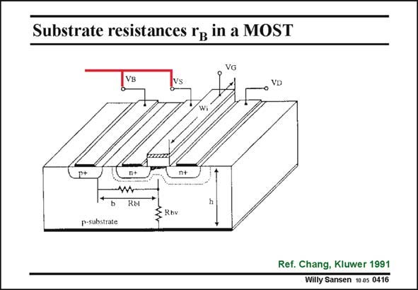

# SANSEN-0416 · Substrate resistances rg in a MOST

章节：04 基本晶体管级的噪声性能  
PDF 页：122；书本页：125；幻灯片编号：0416  
状态：unreviewed



## 对应教材讲解

### PDF 122 · 书本 125

This is also very much the case for the Substrate resistance. Even if the Substrate contact is shorted to the Source contact, it is impossible to avoid the presence of a Substrate resistance. Its value evidently depends on whether the substrate has a back contact or not. It is difficult to calculate its value because it is a distributed resistance. It will always be present. This resistance gives noise, which has to be included in the small-signal diagram.

## 公式／性能结论候选摘录

以下为规则截取的原文，尚未逐项判读。

- PDF 122: Its value evidently depends on whether the substrate has a back contact or not.

## 曲线结论候选摘录

以下为规则截取的原文，尚未逐项判读。

（未由规则找到；不代表原页没有此类内容。）

## 原文条件与近似候选摘录

以下为规则截取的原文，尚未逐项判读。

（未由规则找到；不代表原页没有此类内容。）

## 幻灯片 OCR（未校正）

```text
Substrate resistances rg in a MOST
VB
VD
Wil
Rы
Rbv
p-substrate
Ref. Chang, Kluwer 1991
Willy Sansen 10.05 0416
```

数学上下标、分数及正负号以原图为准。电路图已保留；未核对的连接不输出成可仿真 netlist。
