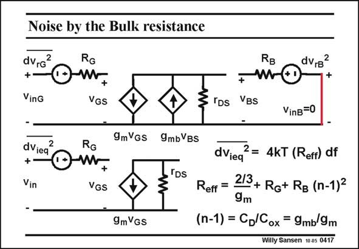

# SANSEN-0417 · Noise by the Bulk resistance

章节：04 基本晶体管级的噪声性能  
PDF 页：122；书本页：125；幻灯片编号：0417  
状态：unreviewed



## 对应教材讲解

### PDF 122 · 书本 125

The noise of the Bulk or Substrate resistance R is B included. It is multiplied by the Bulk transconductance g , to be transferred to the mb output. Then it has to be divided again by the transconductance g itself, to be m transferred to the Gate. The ratio g /g applies in the mb m parameter n−1. The total equivalent input noise voltage includes the contribution of the substrate resistance R , multiplied by B (n−1)2. Again, the value of this resistance R depends on the layout. For low-noise performance, a B large substrate contact will have to be designed.

## 公式／性能结论候选摘录

以下为规则截取的原文，尚未逐项判读。

- PDF 122: Again, the value of this resistance R depends on the layout.

## 曲线结论候选摘录

以下为规则截取的原文，尚未逐项判读。

（未由规则找到；不代表原页没有此类内容。）

## 原文条件与近似候选摘录

以下为规则截取的原文，尚未逐项判读。

（未由规则找到；不代表原页没有此类内容。）

## 幻灯片 OCR（未校正）

```text
Noise by the Bulk resistance
dvrg
2
+
VinG
RG
VGS
IDs
RB
dv,b
+
mo
+
VBs
VinB=0
9mVGs
dVieq
+
Vin
RG
+
VGS
9mbVBs
'DS
9mVGS
dVieq
2= 4kT (Reff) df
Reff =
213+ Ro+ Rg (n-1)2
9m
(n-1) = CD Cox = 9mb 9m
Willy Sansen 10 a5 0417
```

数学上下标、分数及正负号以原图为准。电路图已保留；未核对的连接不输出成可仿真 netlist。
