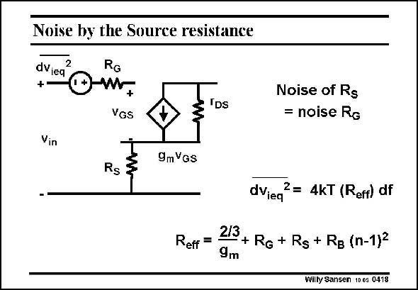

# SANSEN-0418 · Noise by the Source resistance

章节：04 基本晶体管级的噪声性能  
PDF 页：123；书本页：126；幻灯片编号：0418  
状态：unreviewed



## 对应教材讲解

### PDF 122 · 书本 125

The last contribution to the equivalent input noise voltage is given by the series resistance in the Source itself. Normally, this is quite small, but depending on the effective channel length. It is easy to show (see next slide) that the noise of the Source resistor can simply be added to the noise of the Gate resistor. It is as if the Source resistor itself can be added to the Gate resistor.

### PDF 123 · 书本 126

The realization of a large low-noise MOST requires the simultaneous minimization of all four contributions. Quite often the bulk resistor R is forgotten in B the design plan!! Nowadays, for deep submicron CMOS, the channel noise contribution seems to have a coefficient larger than 2/3. Values of up to 2 have been measured. It is not yet clear, whether this is because of the upcoming effect of velocity saturation or with breakdown or punch-through.

## 公式／性能结论候选摘录

以下为规则截取的原文，尚未逐项判读。

- PDF 122: Normally, this is quite small, but depending on the effective channel length.

## 曲线结论候选摘录

以下为规则截取的原文，尚未逐项判读。

（未由规则找到；不代表原页没有此类内容。）

## 原文条件与近似候选摘录

以下为规则截取的原文，尚未逐项判读。

- PDF 123: It is not yet clear, whether this is because of the upcoming effect of velocity saturation or with breakdown or punch-through.

## 幻灯片 OCR（未校正）

```text
Noise by the Source resistance
2
dVieq
RG
+-
0m7
VGS
IDs
Noise of Rs
= noise Rg
Vin
9mVgs
Rs
Reff =
dViea
2= 4kT (Reff) df
213 + Ro + Rs + Rg (n-1)2
Willy Sansen 10 0s 0418
```

数学上下标、分数及正负号以原图为准。电路图已保留；未核对的连接不输出成可仿真 netlist。
