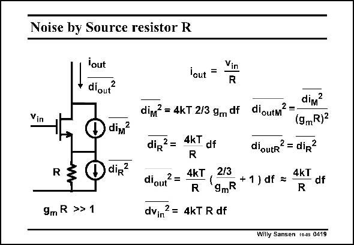

# SANSEN-0419 · Noise by Source resistor R

章节：04 基本晶体管级的噪声性能  
PDF 页：123；书本页：126；幻灯片编号：0419  
状态：unreviewed



## 对应教材讲解

### PDF 123 · 书本 126

The noise of the Source resistor R can simply be added to the noise of the Gate resistor. The calculation is given in this slide. We firstly assume that this resistor is larger than 1/g . m Otherwise it has no effect! We now calculate the contribution of the channel noise to the output. It is the channel noise itself divided by (g R)2. m We then calculate the contribution of the resistor noise to the output. It is simply 4kT/R. When we take the sum of both, we see that the channel noise of the transistor has become negligible, compared to the resistor noise. Indeed, g R is much larger than unity. m As a result, the equivalent input noise voltage is dominated by the resistor noise. Moreover, the expression is the same as for the Gate resistance noise.

## 公式／性能结论候选摘录

以下为规则截取的原文，尚未逐项判读。

- PDF 123: Indeed, g R is much larger than unity. m As a result, the equivalent input noise voltage is dominated by the resistor noise.

## 曲线结论候选摘录

以下为规则截取的原文，尚未逐项判读。

（未由规则找到；不代表原页没有此类内容。）

## 原文条件与近似候选摘录

以下为规则截取的原文，尚未逐项判读。

- PDF 123: We firstly assume that this resistor is larger than 1/g . m Otherwise it has no effect!
- PDF 123: Indeed, g R is much larger than unity. m As a result, the equivalent input noise voltage is dominated by the resistor noise.

## 幻灯片 OCR（未校正）

```text
Noise by Source resistor R
lout
diou?
dim?
R
di?
9mR >>1
lout =
Vin
R
div?
dim? = 4kT 2/3 gm df diourM? -
(9mR)2
diR
2 =
diout
2 =
4kT
df
R
4kT
R
dioutr? = dip?
2/3
4kT
+ 1 ) df =
df
9mR
R
dvin? = 4kT R df
Willy Sansen fo-0s 0419
```

数学上下标、分数及正负号以原图为准。电路图已保留；未核对的连接不输出成可仿真 netlist。
