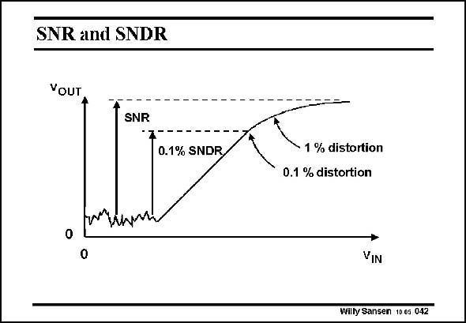

# SANSEN-042 · SNR and SNDR

章节：04 基本晶体管级的噪声性能  
PDF 页：114；书本页：117；幻灯片编号：042  
状态：unreviewed



## 对应教材讲解

### PDF 114 · 书本 117

Every amplifier has noise. When we apply a smallsignal input to an amplifier, then the output signal is an accurate replica of the input, but amplified. The output is proportional to the input, at least in the middle range. When we increase the input signal amplitude, the output amplitude levels off. We generate distortion. The higher we increase the input the flatter the response becomes and the more distortion is generated. In most systems we can allow something like 0.1% distortion. In some audio amplifiers and high-performance analog-to-digital converters we would want rather less than 0.001% distortion!! When we decrease the signal amplitude, it gets lost in noise. The Signal-to-Noise Ratio (SNR) is the highest possible range of input signals we can obtain regardless of distortion. The Signal-to-Noise-and-Distortion Ratio (SNDR) on the other hand, limits this SNR to a certain amount of distortion. Above the 0.1% SNDR is shown, for which the distortion is limited to 0.1%. Clearly the SNDR is always smaller than the SNR.

## 公式／性能结论候选摘录

以下为规则截取的原文，尚未逐项判读。

- PDF 114: The output is proportional to the input, at least in the middle range.
- PDF 114: When we increase the input signal amplitude, the output amplitude levels off.
- PDF 114: The higher we increase the input the flatter the response becomes and the more distortion is generated.
- PDF 114: When we decrease the signal amplitude, it gets lost in noise.
- PDF 114: The Signal-to-Noise-and-Distortion Ratio (SNDR) on the other hand, limits this SNR to a certain amount of distortion.
- PDF 114: Above the 0.1% SNDR is shown, for which the distortion is limited to 0.1%.

## 曲线结论候选摘录

以下为规则截取的原文，尚未逐项判读。

（未由规则找到；不代表原页没有此类内容。）

## 原文条件与近似候选摘录

以下为规则截取的原文，尚未逐项判读。

（未由规则找到；不代表原页没有此类内容。）

## 幻灯片 OCR（未校正）

```text
SNR and SNDR
YOUT
SNR
0.1% SNDR
0
1 % distortion
0.1 % distortion
VIN
Willy Sansen 10 0s 042
```

数学上下标、分数及正负号以原图为准。电路图已保留；未核对的连接不输出成可仿真 netlist。
