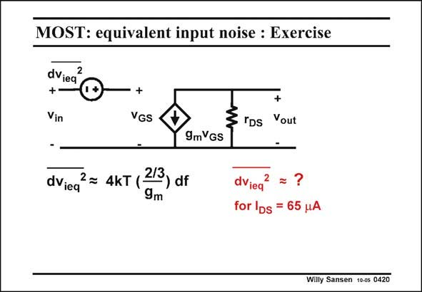

# SANSEN-0420 · MOST: equivalent input noise : Exercise

章节：04 基本晶体管级的噪声性能  
PDF 页：124；书本页：127；幻灯片编号：0420  
状态：unreviewed



## 对应教材讲解

### PDF 124 · 书本 127

As an exercise, let us try to calculate the equivalent input noise voltage of a MOST biased at 65 mA. Only thermal noise is taken into account and the layout is such that all Gate and Bulk resistances can be ignored. The expression is repeated in this slide. A transistor with 65 mA current, generates a transconductance of g =0.65 mS m (if V −V =0.2 V is GS T chosen). The noise resistance 2/3/g is then about m 1 kV. The equivalent input noise voltage is therefore 4 nV /√Hz. RMS

## 公式／性能结论候选摘录

以下为规则截取的原文，尚未逐项判读。

- PDF 124: The equivalent input noise voltage is therefore 4 nV /√Hz.

## 曲线结论候选摘录

以下为规则截取的原文，尚未逐项判读。

（未由规则找到；不代表原页没有此类内容。）

## 原文条件与近似候选摘录

以下为规则截取的原文，尚未逐项判读。

- PDF 124: Only thermal noise is taken into account and the layout is such that all Gate and Bulk resistances can be ignored.

## 幻灯片 OCR（未校正）

```text
MOST: equivalent input noise : Exercise
dViea
2
+-
Vin
+
VGS
+
3 rDs
Yout
9mVGS
dVieq
2 = 4kT ( 2/3) df
9m
dViea
2
for IDs = 65 uA
Willy Sansen 10-05 0420
```

数学上下标、分数及正负号以原图为准。电路图已保留；未核对的连接不输出成可仿真 netlist。
