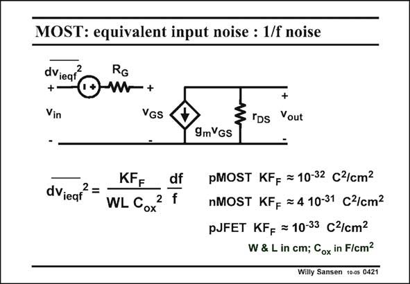

# SANSEN-0421 · MOST: equivalent input noise : 1/f noise

章节：04 基本晶体管级的噪声性能  
PDF 页：124；书本页：127；幻灯片编号：0421  
状态：unreviewed



## 对应教材讲解

### PDF 124 · 书本 127

A MOST device also exhibits a lot of 1/f noise. This is due to the surface states. The silicon has a crystal structure, which is cut off at the surface, where Gate oxide is grown on top. This causes surface states which contribute to the 1/ noise. Several expressions are in use. The one with C 2 in ox the denominator has the advantage, that coefficient KF is nearly independent F of the technology. Actually, all technology effects are represented by the C 2. If we use a KF with C only, then we lose this advantage. ox ox Obviously, the transistor size WL (not W/L) is also included. A MOST with a thin oxide or a small channel length, and a large WL product shows little 1/f noise. We also note that a p-JFET is the transistor with lowest 1/f noise. A pMOST is about ten times worse. A nMOST is by far the worst transistor for 1/f noise. It is 30–60 times larger than for a pMOST of the same size. The expression gives a factor of 40, but there is a large spreading on it! It is for this reason that some audio preamplifiers still want JFETs at their inputs. This also applies to some radiation detection circuitry. Finally note that the equivalent input 1/f noise voltage does not depend on the DC biasing current. The output current depends on the DC current, but not the equivalent input voltage. A small current dependency may sometimes be detected. This is usually negligible.

## 公式／性能结论候选摘录

以下为规则截取的原文，尚未逐项判读。

- PDF 124: The one with C 2 in ox the denominator has the advantage, that coefficient KF is nearly independent F of the technology.
- PDF 124: Finally note that the equivalent input 1/f noise voltage does not depend on the DC biasing current.
- PDF 124: The output current depends on the DC current, but not the equivalent input voltage.
- PDF 124: A small current dependency may sometimes be detected.

## 曲线结论候选摘录

以下为规则截取的原文，尚未逐项判读。

（未由规则找到；不代表原页没有此类内容。）

## 原文条件与近似候选摘录

以下为规则截取的原文，尚未逐项判读。

（未由规则找到；不代表原页没有此类内容。）

## 幻灯片 OCR（未校正）

```text
MOST: equivalent input noise : 1/f noise
dVieaf
2
RG
+-
om+
Vin
VGS
+
§'ps Vout
KF=
df
dVieqf
2 =
WL Cox
2 f
9mVGS
pMOST KF= = 10-32 C¾/сm2
nMOST KFg = 4 10-31 CZ/сm2
PJFET KFg = 10-33 C¾/cm2
W & L in cm; Cox in F/cm?
Willy Sansen 10-05 0421
```

数学上下标、分数及正负号以原图为准。电路图已保留；未核对的连接不输出成可仿真 netlist。
