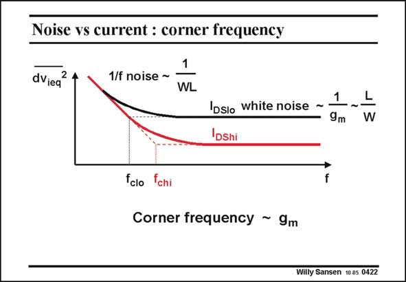

# SANSEN-0422 · Noise vs current : corner frequency

章节：04 基本晶体管级的噪声性能  
PDF 页：125；书本页：128；幻灯片编号：0422  
状态：unreviewed



## 对应教材讲解

### PDF 125 · 书本 128

When we examine the white and 1/f noise together, we notice a very slow crossover from one to the other. Their asymptotes meet at frequency f , called the corner c frequency. Obviously, this frequency depends on the DC biasing current. The higher the current, the larger the transconductance and the lower the white noise. Since the 1/f noise does not change, the corner frequency shifts to the right, for higher DC currents. Actually, the corner frequency is a very strange measure for 1/f noise. The lower the white noise, the higher the corner frequency. Also, note that the thermal noise depends on the ratio W/L, whereas the 1/f noise depends on the WL product. Finally, note that there are circuit techniques to reduce the 1/f noise such as chopping and correlated-double-sampling (Ref. Enz, Temes, Proc. IEEE, Nov.96, 1584–1614). Also switching the biasing of the transistors can reduce the 1/f noise somewhat, as much as 10 dB (Ref. Gierkink, JSSC July 1999, 1022–1025).

## 公式／性能结论候选摘录

以下为规则截取的原文，尚未逐项判读。

- PDF 125: Obviously, this frequency depends on the DC biasing current.
- PDF 125: Also, note that the thermal noise depends on the ratio W/L, whereas the 1/f noise depends on the WL product.

## 曲线结论候选摘录

以下为规则截取的原文，尚未逐项判读。

（未由规则找到；不代表原页没有此类内容。）

## 原文条件与近似候选摘录

以下为规则截取的原文，尚未逐项判读。

（未由规则找到；不代表原页没有此类内容。）

## 幻灯片 OCR（未校正）

```text
Noise vs current : corner frequency
dviea
1/f noise ~
1
WL
1
Iosio white noise ~
9m
IDshi
L
W
fclo
chi
Corner frequency ~ 9m
Willy Sansen 10a5 0422
```

数学上下标、分数及正负号以原图为准。电路图已保留；未核对的连接不输出成可仿真 netlist。
