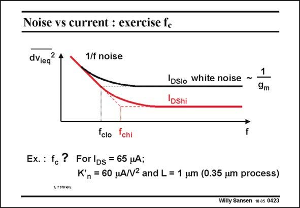

# SANSEN-0423 · Noise vs current : exercise fc

章节：04 基本晶体管级的噪声性能  
PDF 页：125；书本页：128；幻灯片编号：0423  
状态：unreviewed



## 对应教材讲解

### PDF 125 · 书本 128

As an exercise, we want to calculate what the corner frequency f is for the c nMOST of the previous exercise, with a DC current of 65 mA. We use a technology of 0.35 mm CMOS with a K∞ as given; the channel length has been chosen to be three times larger (for gain). Simply plugging all the values in the 1/f noise expression yields an f of c 370 kHz. It is clear that small-sized MOST are no good for audio applications. Power MOSTs are ideal for that!

## 公式／性能结论候选摘录

以下为规则截取的原文，尚未逐项判读。

- PDF 125: We use a technology of 0.35 mm CMOS with a K∞ as given; the channel length has been chosen to be three times larger (for gain).

## 曲线结论候选摘录

以下为规则截取的原文，尚未逐项判读。

（未由规则找到；不代表原页没有此类内容。）

## 原文条件与近似候选摘录

以下为规则截取的原文，尚未逐项判读。

（未由规则找到；不代表原页没有此类内容。）

## 幻灯片 OCR（未校正）

```text
Noise vs current : exercise fc
dViea
2 4
1/f noise
IDsio white noise ~
IDshi
1
9m
fclo
fchi
f
Ex. : fc ? ForlDs = 65 ,uA;
Kn= 60 MA/N2 and L = 1 um (0.35 um process)
4,7370 kltz
Willy Sansen 10 a5 0423
```

数学上下标、分数及正负号以原图为准。电路图已保留；未核对的连接不输出成可仿真 netlist。
