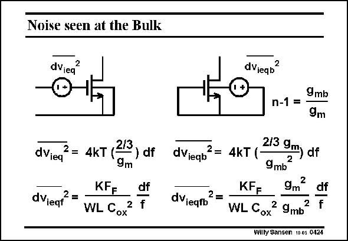

# SANSEN-0424 · Noise seen at the Bulk

章节：04 基本晶体管级的噪声性能  
PDF 页：126；书本页：129；幻灯片编号：0424  
状态：unreviewed



## 对应教材讲解

### PDF 126 · 书本 129

When a MOST is driven at its Bulk rather than at its Gate, then the Bulk transconductance g has to be mb used rather than the transconductance g . Remember m that their ratio is n−1 (see Chapter 1), which is not known accurately, but lies somewhere between 0.3 and 0.5. The equivalent input noise voltages that are present at the Bulk, are then different. They are repeated at the Gate on the left. They are given by the expressions on the right. Both expressions contain the Bulk transconductance g squared. Since g is always smaller than g , the Bulk equivalent input noise is always mb mb m larger than the Gate equivalent input noise. This evidently applies to both the white noise and the 1/f noise. A Bulk drive is therefore not a good solution for noise.

## 公式／性能结论候选摘录

以下为规则截取的原文，尚未逐项判读。

- PDF 126: A Bulk drive is therefore not a good solution for noise.

## 曲线结论候选摘录

以下为规则截取的原文，尚未逐项判读。

（未由规则找到；不代表原页没有此类内容。）

## 原文条件与近似候选摘录

以下为规则截取的原文，尚未逐项判读。

（未由规则找到；不代表原页没有此类内容。）

## 幻灯片 OCR（未校正）

```text
Noise seen at the Bulk
dVieq
2
dVieqb?
dViea
dVieqf
2=
2/3
= 4kT (
) df
9m
KF=
df
WL Cox
2 f
dVieqb
2=
dVieqio
2
=
9mb
n-1 =
9m
4kT (
2/3 9m df
9mb
2
KF=
9m
df
f
WL Cox
2 9mb
Willy Sansen 100s 0424
```

数学上下标、分数及正负号以原图为准。电路图已保留；未核对的连接不输出成可仿真 netlist。
