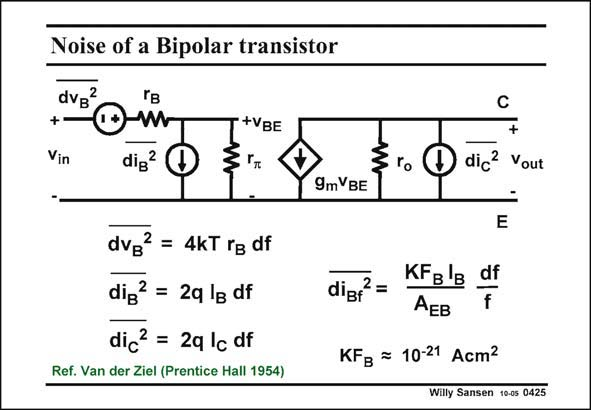

# SANSEN-0425 · Noise of a Bipolar transistor

章节：04 基本晶体管级的噪声性能  
PDF 页：126；书本页：129；幻灯片编号：0425  
状态：unreviewed



## 对应教材讲解

### PDF 126 · 书本 129

A bipolar transistor has two pn-junctions, through which current flows. As a result two sources of shot noise will have to be present. They are added in the small-signal model in this slide. They are white noise sources. One collector shot noise current source is added between collector and emitter. It is proportional to the collector current. The other one is between base and emitter and is proportional to the base current. Finally, a resistive base resistance noise voltage has to be added in series with the base input. Normally, the 1/f noise is added to the base shot noise current source. For a silicon transistor, an average value of the KF factor is given in this slide. Normally, the 1/f noise of a bipolar transistor is much lower than of a MOST because the current flows in the bulk, not at the surface. The 1/f noise is again inversely proportional to the emitter size A . EB

## 公式／性能结论候选摘录

以下为规则截取的原文，尚未逐项判读。

- PDF 126: As a result two sources of shot noise will have to be present.
- PDF 126: It is proportional to the collector current.
- PDF 126: The other one is between base and emitter and is proportional to the base current.
- PDF 126: The 1/f noise is again inversely proportional to the emitter size A .

## 曲线结论候选摘录

以下为规则截取的原文，尚未逐项判读。

（未由规则找到；不代表原页没有此类内容。）

## 原文条件与近似候选摘录

以下为规则截取的原文，尚未逐项判读。

（未由规则找到；不代表原页没有此类内容。）

## 幻灯片 OCR（未校正）

```text
Noise of a Bipolar transistor
dvB
2
+
Vin
W
dig?
+VBE
C
dic? Vout
9mVBE
dVB
2 = 4KT rg df
dig? = 2q lg df
dic2 = 2q lc df
Ref. Van der Ziel (Prentice Hall 1954)|
diBf
2
KFg'B
AEB
df
KFB = 10-21 Acm2
Willy Sansen 100s 0425
```

数学上下标、分数及正负号以原图为准。电路图已保留；未核对的连接不输出成可仿真 netlist。
