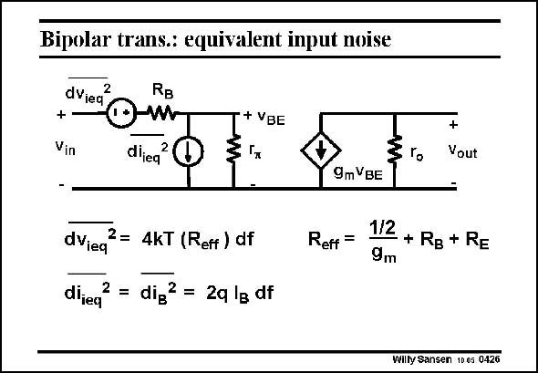

# SANSEN-0426 · Bipolar trans: equivalent input noise

章节：04 基本晶体管级的噪声性能  
PDF 页：127；书本页：130；幻灯片编号：0426  
状态：unreviewed



## 对应教材讲解

### PDF 127 · 书本 130

Again the noise sources can be combined at the input, in order to be able to compare them to the input signal. The collector shot noise has to be divided by g 2 in m order to be translated into an input voltage. The base shot noise remains where it is. As a result, two equivalent noise sources are found, a voltage noise source and a current noise source, which is actually the base shot noise. Which one is dominant will depend on the source impedance, as we will see later. The equivalent input noise voltage obviously also includes the base and emitter resistances. Note that the expression of the equivalent input voltage is very similar to the one for MOST. The only difference is that now the coefficient of 1/g is 1/2 instead of 2/3. This is small difference m indeed. We cannot forget however that for the same DC current the transconductance of a bipolar transistor is about 4 times larger than for a MOST. Its equivalent input noise voltage will therefore decrease.

## 公式／性能结论候选摘录

以下为规则截取的原文，尚未逐项判读。

- PDF 127: As a result, two equivalent noise sources are found, a voltage noise source and a current noise source, which is actually the base shot noise.
- PDF 127: Which one is dominant will depend on the source impedance, as we will see later.
- PDF 127: Its equivalent input noise voltage will therefore decrease.

## 曲线结论候选摘录

以下为规则截取的原文，尚未逐项判读。

（未由规则找到；不代表原页没有此类内容。）

## 原文条件与近似候选摘录

以下为规则截取的原文，尚未逐项判读。

（未由规则找到；不代表原页没有此类内容。）

## 幻灯片 OCR（未校正）

```text
Bipolar trans: equivalent input noise
dVied
2
RB
+ VBE
Vin
diieq
2
3
гo
+
Vout
dViea
2= 4kT (Reff ) df
dijeq
2 = dig2 = 2q lg df
Reff =
9mVBE
1/2
- + RB + RE
9m
Willy Sansen 10 0s 0426
```

数学上下标、分数及正负号以原图为准。电路图已保留；未核对的连接不输出成可仿真 netlist。
