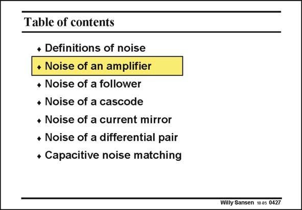

# SANSEN-0427 · Table of contents

章节：04 基本晶体管级的噪声性能  
PDF 页：127；书本页：130；幻灯片编号：0427  
状态：unreviewed



## 对应教材讲解

### PDF 127 · 书本 130

Now that we know what the noise models are for a MOST and a bipolar transistor, we want to use them to calculate the SNR of an amplifier, a cascode, etc. Moreover we have used ideal current sources for the biasing and as active loads. All the current sources have to be realized by means of transistors, which also exhibit noise.

## 公式／性能结论候选摘录

以下为规则截取的原文，尚未逐项判读。

（未由规则找到；不代表原页没有此类内容。）

## 曲线结论候选摘录

以下为规则截取的原文，尚未逐项判读。

（未由规则找到；不代表原页没有此类内容。）

## 原文条件与近似候选摘录

以下为规则截取的原文，尚未逐项判读。

（未由规则找到；不代表原页没有此类内容。）

## 幻灯片 OCR（未校正）

```text
Table of contents
• Definitions of noise
• Noise of an amplifier
• Noise of a follower
• Noise of a cascode
• Noise of a current mirror
* Noise of a differential pair
• Capacitive noise matching
Willy Sansen 10 a5 0427
```

数学上下标、分数及正负号以原图为准。电路图已保留；未核对的连接不输出成可仿真 netlist。
