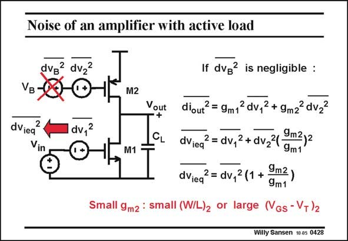

# SANSEN-0428 · Noise of an amplifier with active load

章节：04 基本晶体管级的噪声性能  
PDF 页：128；书本页：131；幻灯片编号：0428  
状态：unreviewed



## 对应教材讲解

### PDF 127 · 书本 130

Addition of an active load M2 to a single-transistor amplifier M1, gives the circuit in this slide. The equivalent input noise source of the load transistor M2 is shown explicitly. It is in series

### PDF 128 · 书本 131

with the noise coming from the biasing voltage V . B Normally, this biasing voltage is followed by a large decoupling capacitance to ground, such that the noise from it can be ignored. The noise of the load transistor M2 is now amplified by g towards the m2 output. It has to be divided by g to be referred to the m1 input. The noise of transistor M2 is therefore multiplied by a factor g /g . m2 m1 To make the noise contribution of M2 negligible, we must design this load transistor with large V −V or small W/L, which is actually the same. GS T Both transistors now carry the same DC current. Transconductance g can only be made m2 smaller if it is designed for a larger V −V , such as 0.5 V. The input transistor then keeps GS T 0.2 V as a V −V . GS T This is an important conclusion, which will be repeated many times. Current source and current mirror devices must be designed for small size W/L and hence for large V −V ! GS T Note that only the white noise sources have been considered here.

## 公式／性能结论候选摘录

以下为规则截取的原文，尚未逐项判读。

- PDF 128: The noise of transistor M2 is therefore multiplied by a factor g /g . m2 m1 To make the noise contribution of M2 negligible, we must design this load transistor with large V −V or small W/L, which is actually the same.
- PDF 128: GS T This is an important conclusion, which will be repeated many times.

## 曲线结论候选摘录

以下为规则截取的原文，尚未逐项判读。

（未由规则找到；不代表原页没有此类内容。）

## 原文条件与近似候选摘录

以下为规则截取的原文，尚未逐项判读。

- PDF 128: B Normally, this biasing voltage is followed by a large decoupling capacitance to ground, such that the noise from it can be ignored.

## 幻灯片 OCR（未校正）

```text
Noise of an amplifier with active load
dvg? dv2
VB-
dViea
2
V
dv,2
M2
Vout
+
M1
If dvg? is negligible :
diout? = gm12 dv,2 + 9mz2 dv22
dViea = dv,2 + dv24 9m2)2
dViea2 = dv,2 (1 +
9m2)
9m1
Small 9m2 : small (W/L)2 or large (Vgs - V+)2
Willy Sansen 10.85 0428
```

数学上下标、分数及正负号以原图为准。电路图已保留；未核对的连接不输出成可仿真 netlist。
