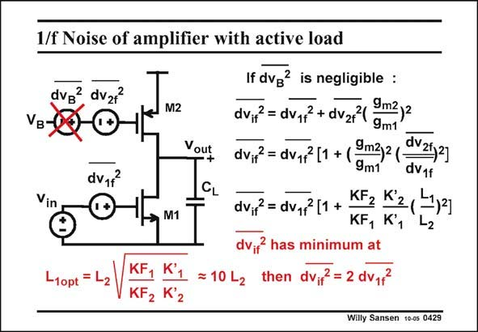

# SANSEN-0429 · 1/f Noise of amplifier with active load

章节：04 基本晶体管级的噪声性能  
PDF 页：128；书本页：131；幻灯片编号：0429  
状态：unreviewed



## 对应教材讲解

### PDF 128 · 书本 131

The same analysis can be repeated for 1/f noise. However, all 1/f noise sources contain the area WL of the transistors. The resulting expression are therefore more cumbersome. Moreover the equivalent input noise voltage shows a minimum, if the input channel length is taken as a variable. It shows that the input transistor channel length L 1 must be about 10 times larger than load transistor channel length L . This is not a problem as the load transistor has normally a small W/L. It is 2 normally a small square device. The drawback could then be that the gain is reduced as a result of the small channel length L . Cascodes will therefore be needed to alleviate this problem. 2

## 公式／性能结论候选摘录

以下为规则截取的原文，尚未逐项判读。

- PDF 128: The resulting expression are therefore more cumbersome.
- PDF 128: The drawback could then be that the gain is reduced as a result of the small channel length L .
- PDF 128: Cascodes will therefore be needed to alleviate this problem. 2

## 曲线结论候选摘录

以下为规则截取的原文，尚未逐项判读。

（未由规则找到；不代表原页没有此类内容。）

## 原文条件与近似候选摘录

以下为规则截取的原文，尚未逐项判读。

（未由规则找到；不代表原页没有此类内容。）

## 幻灯片 OCR（未校正）

```text
1/f Noise of amplifier with active load
dvg? dv27
VB-
dv1f
M2
Yout
M1
-1opt
-2
KF,
K'1
KF2 l
N 2
=10 L2
If dvg? is negligible :
dv,7 = dv,7 + dv27/ 9m2)2
9m1
dv,7 = dv,7 (1 + ( 9m2)2(
dv212]
9m1
dV1f
dv,7 = dv,7(1+ KFz K2(
KF, K1
dv.? has minimum at
then dv?=2 dv1f
Willy Sansen 10-0s 0429
```

数学上下标、分数及正负号以原图为准。电路图已保留；未核对的连接不输出成可仿真 netlist。
