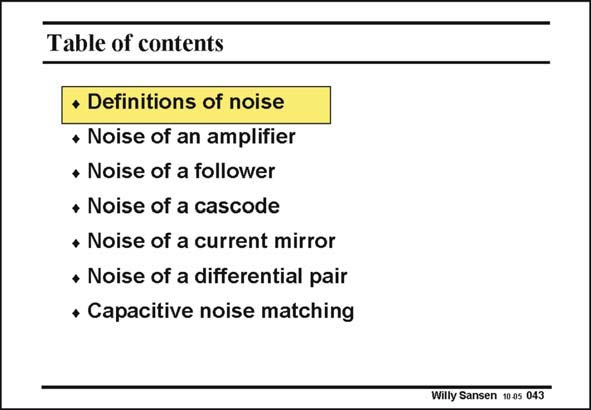

# SANSEN-043 · Table of contents

章节：04 基本晶体管级的噪声性能  
PDF 页：115；书本页：118；幻灯片编号：043  
状态：unreviewed



## 对应教材讲解

### PDF 115 · 书本 118

We will firstly examine how we can describe noise. After all, this is a quantity that comes as a power, not a voltage or current! Then we will discuss all circuits that we have seen hitherto from the point of view of noise performance. The main points will be how to optimize noise performance. For a resistive input source, we will optimize the current flowing. For a capacitive input source, we will perform what is called ‘‘capacitive noise matching’’.

## 公式／性能结论候选摘录

以下为规则截取的原文，尚未逐项判读。

（未由规则找到；不代表原页没有此类内容。）

## 曲线结论候选摘录

以下为规则截取的原文，尚未逐项判读。

（未由规则找到；不代表原页没有此类内容。）

## 原文条件与近似候选摘录

以下为规则截取的原文，尚未逐项判读。

（未由规则找到；不代表原页没有此类内容。）

## 幻灯片 OCR（未校正）

```text
Table of contents
• Definitions of noise
• Noise of an amplifier
• Noise of a follower
+ Noise of a cascode
• Noise of a current mirror
• Noise of a differential pair
• Capacitive noise matching
Willy Sansen 10.05 043
```

数学上下标、分数及正负号以原图为准。电路图已保留；未核对的连接不输出成可仿真 netlist。
