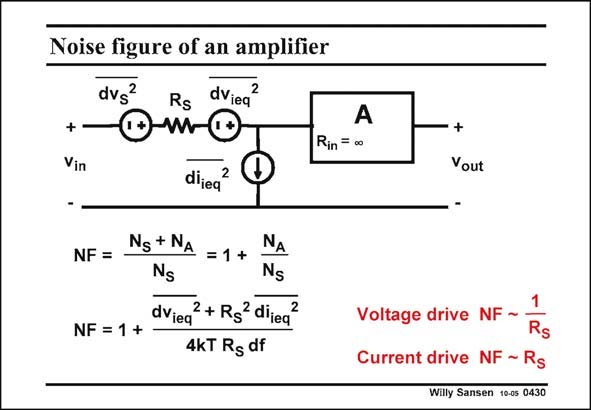

# SANSEN-0430 · Noise figure of an amplifier

章节：04 基本晶体管级的噪声性能  
PDF 页：129；书本页：132；幻灯片编号：0430  
状态：unreviewed



## 对应教材讲解

### PDF 129 · 书本 132

An amplifier which is used in a system with a characteristic impedance, such as 600 V in audio and 50 V in RF circuits, is characterized by a Noise Figure NF. The Noise Figure is defined as the ratio of the total input noise to the noise of the source impedance R . S It actually indicates how much noise is added by the amplifier to the noise already present by the characteristic source impedance R . S If we now take an amplifier with both an input noise voltage and current (understanding that a MOST amplifier has no input noise current), then we can easily determine the expression of the Noise Figure. The noise source that is now dominant, depends on the value of the source resistor R . S For a small R , the amplifier is voltage-driven. In this case R di in the numerator is negligible. S S ieq The noise voltage is then dominant. This is not at all surprising, a noise performance of a voltage-driven amplifier is governed by the equivalent input noise voltage. The Noise Figure then decreases for increasing R . For a S large R , the amplifier is current-driven. In this case, dv in the numerator is negligible. The S ieq noise current is then dominant and the Noise Figure increases for increasing R . S There must therefore be a minimum, versus R . S

## 公式／性能结论候选摘录

以下为规则截取的原文，尚未逐项判读。

- PDF 129: The noise source that is now dominant, depends on the value of the source resistor R .
- PDF 129: The Noise Figure then decreases for increasing R .
- PDF 129: The S ieq noise current is then dominant and the Noise Figure increases for increasing R .
- PDF 129: S There must therefore be a minimum, versus R .

## 曲线结论候选摘录

以下为规则截取的原文，尚未逐项判读。

- PDF 129: An amplifier which is used in a system with a characteristic impedance, such as 600 V in audio and 50 V in RF circuits, is characterized by a Noise Figure NF.
- PDF 129: S It actually indicates how much noise is added by the amplifier to the noise already present by the characteristic source impedance R .

## 原文条件与近似候选摘录

以下为规则截取的原文，尚未逐项判读。

（未由规则找到；不代表原页没有此类内容。）

## 幻灯片 OCR（未校正）

```text
Noise figure of an amplifier
dvsª
Rs dVieq
2
om
+-
Vin
dijeq
2
NF =
Ng + NA
=1+
NA
Ng
Ng
dvieq
? + Rg2 diieq
NF = 1 +
4KT Rg df
Rin = 00
+
Vout
Voltage drive NF ~
Rs
Current drive NF - Rs
Willy Sansen 100s 0430
```

数学上下标、分数及正负号以原图为准。电路图已保留；未核对的连接不输出成可仿真 netlist。
