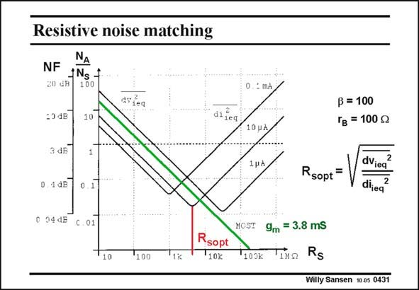

# SANSEN-0431 · Resistive noise matching

章节：04 基本晶体管级的噪声性能  
PDF 页：129；书本页：132；幻灯片编号：0431  
状态：unreviewed



## 对应教材讲解

### PDF 129 · 书本 132

This minimum is clearly visible when the NF, together with the N /N ratio, is A S plotted versus R . S For small values of R , the S NF decreases, but increases again for large values of R . S The minimum in the middle is simply obtained for the ratio of the two equivalent input noise sources. Operating a bipolar amplifier in this minimum is called Resistive Noise Matching. Note that for a voltage drive, the larger current gives the larger g and the lower NF. On the other hand, for a current m

### PDF 130 · 书本 133

drive, the larger current gives a larger base shot noise and hence a larger NF. This is exactly the opposite result. A MOST does not have an input noise current. Its NF is a straight line, decreasing continuously. It is clear that for large source impedances, a bipolar transistor will never be used. The base noise current would flow in this large source resistance and kill the noise performance. Large source resistances are very common. Examples are preamplifiers for photodiodes, biopotentials, but also low-frequency capacitive pressure sensors, etc.

## 公式／性能结论候选摘录

以下为规则截取的原文，尚未逐项判读。

- PDF 129: S For small values of R , the S NF decreases, but increases again for large values of R .

## 曲线结论候选摘录

以下为规则截取的原文，尚未逐项判读。

- PDF 129: This minimum is clearly visible when the NF, together with the N /N ratio, is A S plotted versus R .

## 原文条件与近似候选摘录

以下为规则截取的原文，尚未逐项判读。

（未由规则找到；不代表原页没有此类内容。）

## 幻灯片 OCR（未校正）

```text
Resistive noise matching
≤1
NF
jNg +
20 CB
100
=3dB
10
dideq
0.
: mÀ
di leg
10 pÀ
ß = 100
Гg = 100 g
3 dB
1pà
0. 1 B
Rsopt =
0.1
dVieg
dijea
0 34 dE
C.01
HGST
10
100
1k
Rsopt
10k
100k
9m = 3.8 mS
Tino
Rs
Willy Sansen 10.85 0431
```

数学上下标、分数及正负号以原图为准。电路图已保留；未核对的连接不输出成可仿真 netlist。
