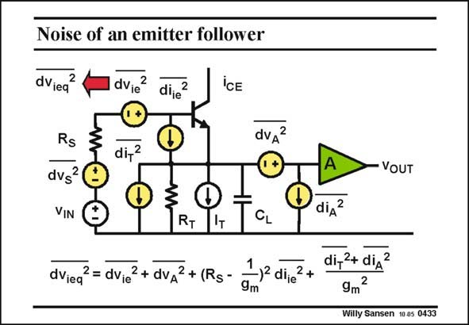

# SANSEN-0433 · Noise of an emitter follower

章节：04 基本晶体管级的噪声性能  
PDF 页：130；书本页：133；幻灯片编号：0433  
状态：unreviewed



## 对应教材讲解

### PDF 130 · 书本 133

A source follower, or an emitter follower in this case, has a gain of at most unity. As a result, the noise of the next amplifier is not attenuated when we refer its noise to the input. When we identify all noise sources for a bipolar realization, not forgetting the output noise of the DC biasing current source I , we then T easily find their contributions to the output. Dividing all output components by the gain gives us the total equivalent input noise voltage. It is clear that the input noise voltages of both the emitter follower and the amplifier, appear

### PDF 131 · 书本 134

together at the input. Moreover, the input noise current of the emitter follower flows through the large resistor R . If this resistor weren’t large, why would we need an emitter follower? S Finally, the current of the emitter follower cannot be too small or the noise current of the current source comes into effect. It can be concluded that the noise performance of a source follower is really poor. It should never be used at the input of a low-noise amplifier!

## 公式／性能结论候选摘录

以下为规则截取的原文，尚未逐项判读。

- PDF 130: A source follower, or an emitter follower in this case, has a gain of at most unity.
- PDF 130: As a result, the noise of the next amplifier is not attenuated when we refer its noise to the input.
- PDF 130: Dividing all output components by the gain gives us the total equivalent input noise voltage.

## 曲线结论候选摘录

以下为规则截取的原文，尚未逐项判读。

（未由规则找到；不代表原页没有此类内容。）

## 原文条件与近似候选摘录

以下为规则截取的原文，尚未逐项判读。

（未由规则找到；不代表原页没有此类内容。）

## 幻灯片 OCR（未校正）

```text
Noise of an emitter follower
dViea
2
dvie?
dije
2
'CE
dv 2
di,2
dvs
2
VIN
RT
IT
dViea?= dvie2+ dva2+ (Rs-
CL
)- dije
9m
VOUT
diд2
di,2+ diд 2
9m2
Willy Sansen 10.85 0433
```

数学上下标、分数及正负号以原图为准。电路图已保留；未核对的连接不输出成可仿真 netlist。
