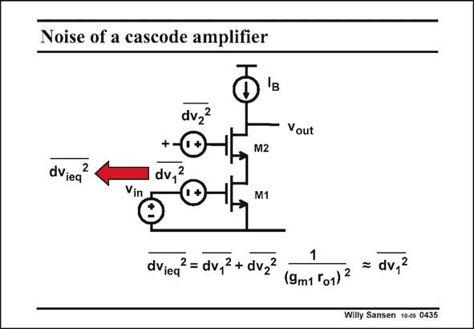

# SANSEN-0435 · Noise of a cascode amplifier

章节：04 基本晶体管级的噪声性能  
PDF 页：131；书本页：134；幻灯片编号：0435  
状态：unreviewed



## 对应教材讲解

### PDF 131 · 书本 134

Indeed, we like using cascodes because they add a lot of gain without increasing the current consumption. The question now is whether cascode transistor M2, which heavily contributes to the gain, will also contribute to the noise. The answer is negative! For both transistors the equivalent input noise voltage is in series with the Gate. The noise voltage of the cascode transistor M2, will be visible at its Source terminal but cannot influence the current through it. Actually, M2 acts as a source follower for its noise source dv2. As a result the output current is insensitive to the noise of the cascode. A calculation of the gain, using small-signal models for the transistors (with g and r ), shows m o that the equivalent input noise voltage of the cascode has to be divided by the gain of the input

### PDF 132 · 书本 135

transistor, squared. Even if this gain is very low, as in deep submicron CMOS, the squaring will make sure that the noise of M2 is neglected. As a result, the noise of a two-transistor cascode is the same as for the input transistor. And yet the cascode does contribute to the gain! This is why cascodes are so frequently used!

## 公式／性能结论候选摘录

以下为规则截取的原文，尚未逐项判读。

- PDF 131: Indeed, we like using cascodes because they add a lot of gain without increasing the current consumption.
- PDF 131: The question now is whether cascode transistor M2, which heavily contributes to the gain, will also contribute to the noise.
- PDF 131: As a result the output current is insensitive to the noise of the cascode.
- PDF 131: A calculation of the gain, using small-signal models for the transistors (with g and r ), shows m o that the equivalent input noise voltage of the cascode has to be divided by the gain of the input
- PDF 132: Even if this gain is very low, as in deep submicron CMOS, the squaring will make sure that the noise of M2 is neglected.
- PDF 132: As a result, the noise of a two-transistor cascode is the same as for the input transistor.
- PDF 132: And yet the cascode does contribute to the gain!

## 曲线结论候选摘录

以下为规则截取的原文，尚未逐项判读。

（未由规则找到；不代表原页没有此类内容。）

## 原文条件与近似候选摘录

以下为规则截取的原文，尚未逐项判读。

- PDF 132: Even if this gain is very low, as in deep submicron CMOS, the squaring will make sure that the noise of M2 is neglected.

## 幻灯片 OCR（未校正）

```text
Noise of a cascode amplifier
dviea
dvz2
+@-
dv,2
Vout
Vin
M2
M1
1
dVieq
2 = dv, 2 + dvz2
(9m1 5o1) 2
= dv,2
Willy Sansen 100s 0435
```

数学上下标、分数及正负号以原图为准。电路图已保留；未核对的连接不输出成可仿真 netlist。
