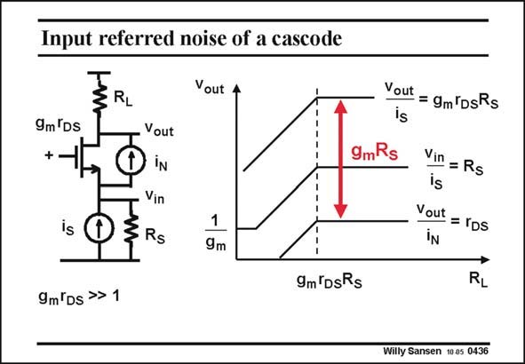

# SANSEN-0436 · Input referred noise of a cascode

章节：04 基本晶体管级的噪声性能  
PDF 页：132；书本页：135；幻灯片编号：0436  
状态：unreviewed



## 对应教材讲解

### PDF 132 · 书本 135

Another way to look at the noise performance is to concentrate on the cascode only. Current source i is the S input current source, coming eventually from another transistor. Current source i is the cascode N noise current. For large values of load resistor R , we find that the L cascode noise current i is N simply multiplied by R S toward the output. The input signal current i is S multiplied by a much larger factor, i.e. g r R , or g R times greater than i . m DS S m S N This factor g R is therefore the value by which the input current is more amplified than the m S cascode noise current. This is why the noise of the cascode is negligible. This factor g R depends on R however. If the cascode is not driven by a real current source, m S S with large output resistance, then this noise reduction decreases, as shown next.

## 公式／性能结论候选摘录

以下为规则截取的原文，尚未逐项判读。

- PDF 132: The input signal current i is S multiplied by a much larger factor, i.e. g r R , or g R times greater than i . m DS S m S N This factor g R is therefore the value by which the input current is more amplified than the m S cascode noise current.
- PDF 132: This factor g R depends on R however.
- PDF 132: If the cascode is not driven by a real current source, m S S with large output resistance, then this noise reduction decreases, as shown next.

## 曲线结论候选摘录

以下为规则截取的原文，尚未逐项判读。

（未由规则找到；不代表原页没有此类内容。）

## 原文条件与近似候选摘录

以下为规则截取的原文，尚未逐项判读。

- PDF 132: The input signal current i is S multiplied by a much larger factor, i.e. g r R , or g R times greater than i . m DS S m S N This factor g R is therefore the value by which the input current is more amplified than the m S cascode noise current.

## 幻灯片 OCR（未校正）

```text
Input referred noise of a cascode
w1
RL
9m'Ds
+.
is
- Vout
iN
Vin
D
3RS
Vout
1
9m
- - - - ---
- --
9mRs
9m'DsRs
Yout = gmlDsRs
Vin = Rs
Yout = rps
RL
9m'Ds >> 1
Willy Sansen 1005 0436
```

数学上下标、分数及正负号以原图为准。电路图已保留；未核对的连接不输出成可仿真 netlist。
