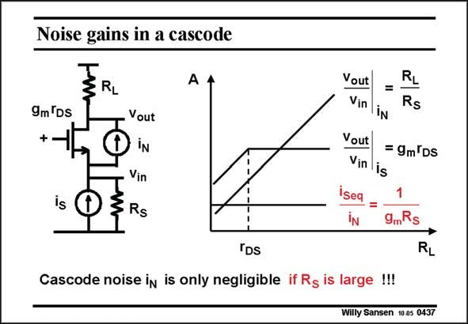

# SANSEN-0437 · Noise gains in a cascode

章节：04 基本晶体管级的噪声性能  
PDF 页：132；书本页：135；幻灯片编号：0437  
状态：unreviewed



## 对应教材讲解

### PDF 132 · 书本 135

Indeed, the voltage gains across the cascode are shown, versus load resistance R . L For a high load resistance, the gain reduction g R is m S clearly visible. This means that the cascode cannot be driven by a low resistance, or by a voltage source, as suggested in some wideband amplifiers. The noise performance then deteriorates really badly.

## 公式／性能结论候选摘录

以下为规则截取的原文，尚未逐项判读。

- PDF 132: L For a high load resistance, the gain reduction g R is m S clearly visible.

## 曲线结论候选摘录

以下为规则截取的原文，尚未逐项判读。

（未由规则找到；不代表原页没有此类内容。）

## 原文条件与近似候选摘录

以下为规则截取的原文，尚未逐项判读。

（未由规则找到；不代表原页没有此类内容。）

## 幻灯片 OCR（未校正）

```text
Noise gains in a cascode
RL
A 4
9m 'Ds
+.
is
D
.Vout
iN
Vin
3RS
Vout |
Vin iN
RL
=
Rs
Vout
= 9m Ds
Vin is
iseq
IN
9Rs
IDs
Cascode noise in is only negligible if Rg is large !!!
RL
Willy Sansen 10-05 0437
```

数学上下标、分数及正负号以原图为准。电路图已保留；未核对的连接不输出成可仿真 netlist。
