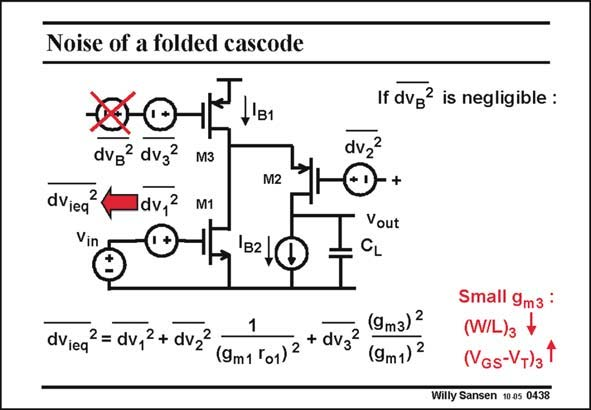

# SANSEN-0438 · Noise of a folded cascode

章节：04 基本晶体管级的噪声性能  
PDF 页：133；书本页：136；幻灯片编号：0438  
状态：unreviewed



## 对应教材讲解

### PDF 133 · 书本 136

A folded cascode contains two DC current sources. The top one, with transistor M3, distributes the DC currents over both stages. The other one acts as an active load. The noise of the top current source is very similar as for an active load. Transistor M3 must be designed with large V − GS V or small W/L. Indeed, T the full expression shows the same g ratio as for a singlem transistor amplifier with active load. The noise of the cascode can be neglected altogether, as shown previously. Its noise is reduced by the gain of the input transistor. A folded cascode is a low-noise amplifier, provided the noise of transistor M3 can be reduced by proper sizing or other techniques.

## 公式／性能结论候选摘录

以下为规则截取的原文，尚未逐项判读。

- PDF 133: Its noise is reduced by the gain of the input transistor.

## 曲线结论候选摘录

以下为规则截取的原文，尚未逐项判读。

（未由规则找到；不代表原页没有此类内容。）

## 原文条件与近似候选摘录

以下为规则截取的原文，尚未逐项判读。

- PDF 133: The noise of the cascode can be neglected altogether, as shown previously.
- PDF 133: A folded cascode is a low-noise amplifier, provided the noise of transistor M3 can be reduced by proper sizing or other techniques.

## 幻灯片 OCR（未校正）

```text
Noise of a folded cascode
If dvg? is negligible :
-'B1
dvg dv32
dV2
M3
M1
dVieq
N
Vin
M2
B2
+
Vout
CL
dvieq
2 = dv1
2 + dV2
(9m1 'o1)
dV3
2
(9 m3) 2
(9m1) 2
Small 9m3 :
(W/L) +
(NGs-VT)3"
Willy Sansen 10.85 0438
```

数学上下标、分数及正负号以原图为准。电路图已保留；未核对的连接不输出成可仿真 netlist。
