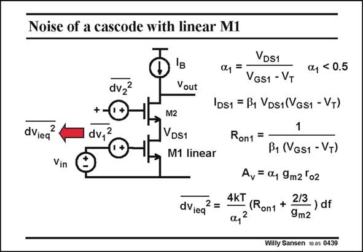

# SANSEN-0439 · Noise of a cascode with linear M1

章节：04 基本晶体管级的噪声性能  
PDF 页：133；书本页：136；幻灯片编号：0439  
状态：unreviewed



## 对应教材讲解

### PDF 133 · 书本 136

Cascodes are sometimes used with an input transistor M1 in the linear region, to avoid distortion at the input. In this case, it is no longer clear whether the noise of the cascode transistor is still negligible. For this purpose we have to introduce a parameter to indicate how deeply the input transistor M1 works in the linear region. This is parameter a . For a =1, the 1 1 transistor is on the onset of saturation. Normally a is about 0.5 or less. 1 The expression describing a MOST in the linear region is given, followed by its on resistance R . on1 The voltage gain is smaller than before. Actually it is only a fraction of the gain of the cascode by itself ! The total equivalent input noise voltage is due to the on resistance R and the thermal noise on1

### PDF 134 · 书本 137

of the cascode. The latter noise source is no longer negligible! Moreover the input noise voltage is even larger because of the a factor in the denominator. 1 The actual small-signal model and calculations are given next.

## 公式／性能结论候选摘录

以下为规则截取的原文，尚未逐项判读。

- PDF 133: Normally a is about 0.5 or less. 1 The expression describing a MOST in the linear region is given, followed by its on resistance R . on1 The voltage gain is smaller than before.
- PDF 133: Actually it is only a fraction of the gain of the cascode by itself !

## 曲线结论候选摘录

以下为规则截取的原文，尚未逐项判读。

（未由规则找到；不代表原页没有此类内容。）

## 原文条件与近似候选摘录

以下为规则截取的原文，尚未逐项判读。

- PDF 133: For a =1, the 1 1 transistor is on the onset of saturation.

## 幻灯片 OCR（未校正）

```text
Noise of a cascode with linear M1
dvz?
Vout
++
dv,2
dViea
2
Vin
M2
VDS1
M1 linear
dViea
VDS1
04 =
04 < 0.5
VGS1 - VT
IDs1 = B1 VDs1(VGs1 - VT)
Ron1 =
B1 (VGs1 - VT)
Av= a, 9m2 'o2
4kT
(Ron1 +
2/3
a42
- ) df
9m2
Willy Sansen 10 05 0439
```

数学上下标、分数及正负号以原图为准。电路图已保留；未核对的连接不输出成可仿真 netlist。
