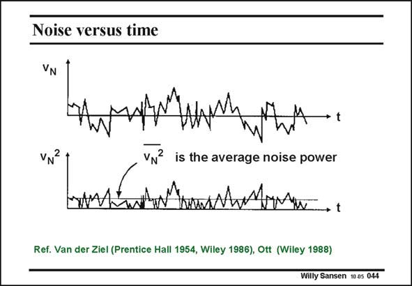

# SANSEN-044 · Noise versus time

章节：04 基本晶体管级的噪声性能  
PDF 页：115；书本页：118；幻灯片编号：044  
状态：unreviewed



## 对应教材讲解

### PDF 115 · 书本 118

Noise is an arbitrary signal. We never know what to expect next. The signal amplitude is unpredictable. As a result there is a Gaussian spreading around zero and the average value is zero. Also, all possible pulses seem to be present, i.e. sharp ones and wide ones. In order to be able to describe noise we have to take the power of the noise. For this purpose, we square the voltage or we rectify the voltage as shown in this slide. The average versus time is now the average noise power. It is clearly not zero but it averages out the peaks over a specific amount of time.

## 公式／性能结论候选摘录

以下为规则截取的原文，尚未逐项判读。

- PDF 115: As a result there is a Gaussian spreading around zero and the average value is zero.

## 曲线结论候选摘录

以下为规则截取的原文，尚未逐项判读。

- PDF 115: It is clearly not zero but it averages out the peaks over a specific amount of time.

## 原文条件与近似候选摘录

以下为规则截取的原文，尚未逐项判读。

（未由规则找到；不代表原页没有此类内容。）

## 幻灯片 OCR（未校正）

```text
Noise versus time
VN? is the average noise power
Ref. Van der Ziel (Prentice Hall 1954, Wiley 1986), Ott (Wiley 1988)
Willy Sansen 10-05 044
```

数学上下标、分数及正负号以原图为准。电路图已保留；未核对的连接不输出成可仿真 netlist。
