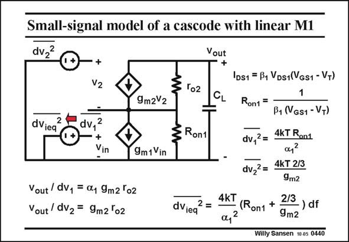

# SANSEN-0440 · Small-signal model of a cascode with linear M1

章节：04 基本晶体管级的噪声性能  
PDF 页：134；书本页：137；幻灯片编号：0440  
状态：unreviewed



## 对应教材讲解

### PDF 134 · 书本 137

The small-signal model of the cascode with an input transistor M1 in the linear region is shown in this slide. Note that the small-signal model of transistor M1, in the linear region, is a current source g v with a small m1 in on resistance R in paralon1 lel. The output noise current is simply due to the on resistance R . It can be referred on1 to the input, as a input noise voltage, by dividing this noise current by g 2. m1 The total equivalent input noise voltage is now the sum of the input noise of transistor M1 and the noise of the cascode. For this calculation, we need to find the gains to the output, of the input noise voltage of the input transistor dv , and of the input noise voltage of the cascode transistor dv . They are both 1 2 given at low frequencies.

## 公式／性能结论候选摘录

以下为规则截取的原文，尚未逐项判读。

（未由规则找到；不代表原页没有此类内容。）

## 曲线结论候选摘录

以下为规则截取的原文，尚未逐项判读。

（未由规则找到；不代表原页没有此类内容。）

## 原文条件与近似候选摘录

以下为规则截取的原文，尚未逐项判读。

（未由规则找到；不代表原页没有此类内容。）

## 幻灯片 OCR（未校正）

```text
Small-signal model of a cascode with linear M1
dv2?
Vout
+
V2
'02
9m2V2
dViea
dv,2
+
Vin
-
Ront
9m 1 Vin
Vout / dv1 = 01 9m2 'o2
Vout/ dV2 = 9m2 'o2
dViea
2
=
IDs1 = B1 VDs1(Vgs1 - V+)
Ron1 =
1
B1 (VGS1 - VT)
dv,2 =
4KT Ron1
dv22=
4kT 2/3
9m2
4kT
(Ron1
a,2
2/3
- ) df
9m2
Willy Sansen 10a5 0440
```

数学上下标、分数及正负号以原图为准。电路图已保留；未核对的连接不输出成可仿真 netlist。
